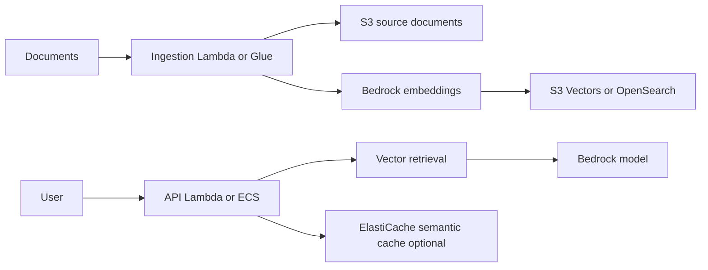

# RAG con Bedrock y Vector Stores

## Caso de uso

Aplicacion de soporte o agente interno responde preguntas usando documentos privados, tickets, wikis y bases de conocimiento.

## Decision principal

Usa **Bedrock + vector store** cuando necesitas grounding sobre conocimiento privado.

Usa **S3 Vectors** para almacenamiento vectorial costo-efectivo y consultas moderadas. Usa **OpenSearch** para alto QPS, hybrid search, facetas o agregaciones. Usa **ElastiCache semantic cache** si las preguntas repetidas elevan costo/latencia.

## Preguntas clave

- Que documentos son fuente de verdad?
- Cada cuanto cambian?
- Que embedding model y dimension usaras?
- Necesitas filtros por tenant, permisos o metadata?
- Cual es QPS esperado?
- Debes explicar fuentes/citas?
- Como evitaras fuga de datos entre tenants?

## Por que estos servicios

- **Bedrock**: modelos administrados.
- **S3**: documentos fuente.
- **S3 Vectors**: vector storage economico.
- **OpenSearch**: busqueda hibrida y alto throughput.
- **DynamoDB**: sesiones y metadata.
- **ElastiCache**: cache semantico o memoria de agente.

## Pros

- Reduce necesidad de fine-tuning inicial.
- Documentos siguen siendo actualizables.
- Puede crecer por capas.
- Buen encaje con serverless.
- Permite trazabilidad de fuentes.

## Contras

- Calidad depende de chunking y metadata.
- Costos de tokens pueden crecer rapido.
- Seguridad multi-tenant es critica.
- Evaluacion automatica requiere esfuerzo.
- Latencia puede subir por retrieval + generation.

## Alertas y costos

Minimo:

- Latencia p95/p99 por retrieval y generation.
- Errores Bedrock throttling.
- Tokens/input-output por request.
- Cache hit rate si hay semantic cache.
- Vector query errors.
- Budget por Bedrock, embeddings, vector store y logs.

Guardrails:

- Filtros por tenant en metadata.
- No guardar prompts con secretos.
- Evaluaciones de calidad y seguridad.
- Rate limits por usuario/API key.
- Cost anomaly por modelo.

## Evolucion natural

- Si QPS sube: OpenSearch o cache.
- Si costo de tokens sube: prompt compression, caching, smaller model.
- Si respuestas fallan: mejorar chunking, metadata y reranking.
- Si hay datos sensibles: ABAC y separacion por tenant.
- Si agentes ejecutan acciones: permisos IAM por herramienta y auditoria.

## Ejercicio de practica

Disena RAG para una wiki interna. Define ingestion, chunking, metadata de permisos, vector store, budget por usuario y metricas de calidad.

