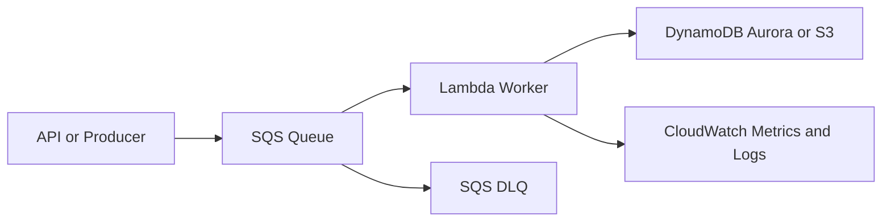

# Worker Asincrono con SQS y Lambda

## Caso de uso

Procesar tareas que no necesitan respuesta inmediata: enviar emails, generar PDFs, sincronizar inventario, procesar pagos diferidos o ejecutar jobs por lotes pequenos.

## Decision principal

Usa **SQS + Lambda** cuando quieres desacoplar productor y consumidor, absorber picos y procesar mensajes con retries administrados.

Usa **SQS FIFO** si necesitas orden por grupo o deduplicacion. Usa **Kinesis/MSK** si necesitas replay, multiples consumidores independientes o alto volumen continuo. Usa **ECS worker** si cada tarea dura mas de 15 minutos o necesita binarios pesados.

## Preguntas clave

- El usuario puede esperar o solo necesita un acuse?
- La tarea es idempotente?
- Que pasa si se procesa dos veces?
- Importa el orden?
- Cuanto tarda el procesamiento p95/p99?
- Como vas a manejar mensajes venenosos?

## Por que estos servicios

- **SQS**: buffer durable con retries y DLQ.
- **Lambda event source mapping**: escala workers segun cola.
- **DLQ**: separa fallos permanentes.
- **CloudWatch alarms**: detecta backlog y errores.

## Pros

- Desacopla picos.
- Reduce fallos en cascada.
- No administra workers.
- Facil limitar concurrencia para proteger downstreams.
- DLQ permite recuperacion.

## Contras

- Semantica at-least-once exige idempotencia.
- Latencia no siempre es inmediata.
- Orden global no existe en SQS Standard.
- Mensajes grandes deben ir a S3.
- Debugging requiere correlation IDs.

## Alertas y costos

Minimo:

- SQS ApproximateAgeOfOldestMessage.
- SQS ApproximateNumberOfMessagesVisible.
- DLQ depth > 0.
- Lambda Errors, Throttles, Duration p99.
- ConcurrentExecutions contra limite reservado.

Reglas practicas:

- Visibility timeout al menos 6x timeout de Lambda.
- Activar partial batch failure reporting.
- Usar reserved concurrency para proteger bases de datos.
- Retencion de logs explicita.

## Evolucion natural

- Si necesitas fan-out: SNS o EventBridge antes de SQS.
- Si necesitas orquestacion: Step Functions.
- Si necesitas replay y consumidores paralelos: Kinesis o MSK.
- Si los workers son CPU-heavy: ECS/Fargate.
- Si el backlog crece siempre: revisar capacidad downstream y batch size.

## Ejercicio de practica

Disena un flujo de generacion de facturas PDF. Define cola, DLQ, idempotency key, alarmas y estrategia de redrive.

