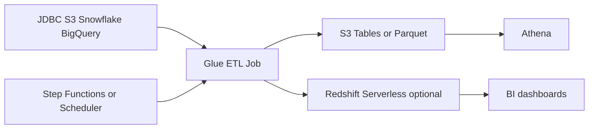
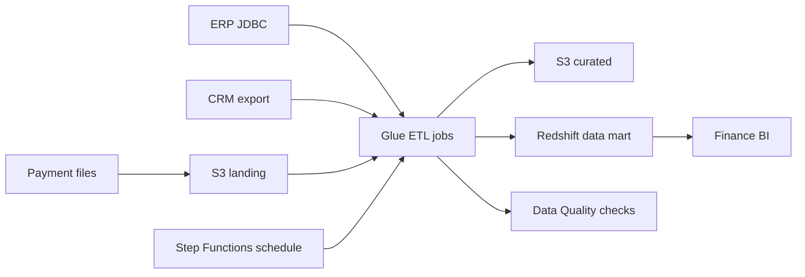

# Batch ETL con Glue y Redshift

## Caso de uso

Cada noche se integran datos desde PostgreSQL, MySQL, S3, Snowflake o BigQuery para reportes, dashboards y modelos analiticos.

## Decision principal

Usa **Glue ETL** para extraccion, transformacion y carga batch administrada. Usa **S3 Tables** como destino por defecto de lakehouse y **Redshift** cuando necesitas warehouse optimizado para BI.

Usa **Athena CTAS/INSERT** para cargas pequenas o simples. Usa **Kinesis/Flink** si necesitas streaming. Usa **MWAA** si necesitas DAGs complejos con muchas dependencias.

## Preguntas clave

- La carga es one-time, recurrente o incremental?
- El source tiene conexion Glue ya creada?
- Necesitas upsert/merge o append?
- Cual es la ventana de procesamiento?
- Como validas conteos y datos criticos?
- El consumidor final usa Athena o BI intensivo?

## Por que estos servicios

- **Glue**: Spark administrado, conectores y jobs.
- **Step Functions/Scheduler**: orquestacion y calendario.
- **S3 Tables/Iceberg**: tabla historica evolucionable.
- **Redshift**: consultas BI rapidas y concurrencia.
- **Glue Data Quality**: controles de calidad.

## Pros

- Reduce administracion de clusters Spark.
- Funciona con multiples fuentes.
- Puede escalar para datos grandes.
- Permite validaciones antes de publicar.
- Se integra con catalogo y Athena.

## Contras

- Jobs Spark requieren tuning.
- Conexiones JDBC y redes pueden fallar.
- No es ideal para baja latencia.
- Costos crecen con DPU y duracion.
- Upserts grandes exigen diseno Iceberg/warehouse.

## Alertas y costos

Minimo:

- Glue job failed, timeout, duration.
- Data quality failed.
- Redshift query latency/concurrency si aplica.
- S3 storage growth.
- Budget por Glue DPU-hours, Redshift y datos escaneados.

Guardrails:

- Validar source vs target row count.
- Checks de nulls en columnas criticas.
- Watermarks para incremental.
- Separar raw, curated y serving.

## Evolucion natural

- Si los pipelines crecen: MWAA o Step Functions modular.
- Si consumo es solo SQL ocasional: Athena basta.
- Si dashboards sufren: Redshift/materialized views.
- Si fuente cambia schema: schema evolution y contratos.
- Si datos llegan continuo: streaming a lake.

## Ejemplos aplicados

### Ejemplo 1: Data mart financiero nocturno

**Contexto:** Una empresa consolida ERP, CRM y pagos externos cada noche para dashboards financieros, cohortes y cierres mensuales.

**Preguntas y respuestas:**

- **Por que batch y no streaming?** El negocio acepta datos diarios, las fuentes son JDBC/SaaS y el costo operativo baja con Glue programado.
- **Cuando entra Redshift?** Cuando BI necesita joins grandes, concurrencia y modelos dimensionales mas rapidos que Athena sobre S3.
- **Como se valida el cierre?** Conteos fuente/destino, checks de nulos, reconciliacion de montos y alarmas por fallos de job.

**Diseno por etapa:**

- **Proyecto inicial:** Glue connections, jobs PySpark, S3 landing, Glue Data Catalog, Step Functions para orden y Redshift Serverless o provisionado.
- **Etapa media:** Cargas incrementales por watermark, Glue Data Quality, notificaciones SNS, secretos en Secrets Manager y budgets por workgroup/cluster.
- **Gran escala:** Data lake historico en S3 Tables, Redshift data sharing, orquestacion multi-dominio y separacion de cuentas de datos.

**Migracion/evolucion:** Si hay scripts cron en una VM, mover primero landing a S3, encapsular transformaciones en Glue, luego reemplazar cron por Step Functions.

**Patrones relacionados:** [data-lake-s3-tables-athena](../data-lake-s3-tables-athena/index.md), [workflow-orchestration-step-functions](../workflow-orchestration-step-functions/index.md), [security-iam-secrets-oidc](../security-iam-secrets-oidc/index.md).

## Ejercicio de practica

Disena carga incremental de `orders` desde PostgreSQL a S3 Tables. Define watermark, validacion, retry y publicacion final.

