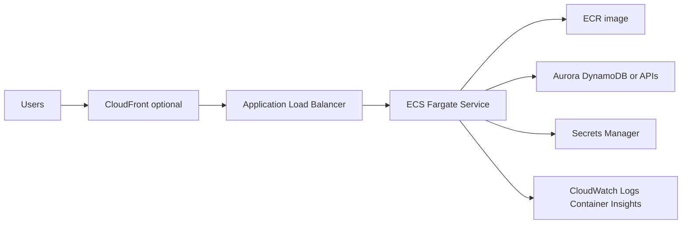

# Web App Containerizada con ECS Fargate y ALB

## Caso de uso

Aplicacion web o API empaquetada en Docker: Node.js, Java, Python, Go o .NET. Necesita HTTP publico, variables de configuracion, secretos, escalado horizontal y despliegues controlados.

## Decision principal

Usa **ECS Fargate + ALB** para workloads HTTP productivos que necesitan contenedores, control de runtime y menos operaciones que EC2.

Usa **ECS Express Mode** para un HTTP app simple y rapido. Usa **Lambda** si el workload es event-driven o esporadico. Usa **EKS** solo si necesitas Kubernetes, operadores o portabilidad K8s.

## Preguntas clave

- La app necesita proceso largo, sockets, workers o dependencias pesadas?
- Puede arrancar rapido y responder health checks?
- Necesita VPC privada, secretos y conexion a base?
- Cuantas replicas minimas requiere disponibilidad?
- Hay cero downtime requerido en deploy?
- Que metrica escala mejor: CPU, memoria, requests o backlog?

## Por que estos servicios

- **ECS Fargate**: no administras hosts.
- **ALB**: routing HTTP, TLS con ACM y health checks.
- **ECR**: repositorio privado con scanning.
- **Secrets Manager/SSM**: secretos inyectados al task.
- **CloudWatch Container Insights**: metricas de contenedor.

## Pros

- Familiar para equipos Docker.
- Control de runtime superior a Lambda.
- Escala horizontal sencilla.
- Deploys con circuit breaker y rollback.
- Funciona bien con ALB, WAF y CloudFront.

## Contras

- Siempre pagas capacidad minima.
- Networking privado puede introducir costos NAT.
- Imagenes grandes ralentizan deploys.
- Health checks mal configurados causan rollbacks.
- IAM se divide entre execution role y task role.

## Alertas y costos

Minimo:

- ALB 5xx, target response time p99, unhealthy target count.
- ECS CPU, memory, task stopped, deployment rollback.
- Log errors por aplicacion.
- Budget por Fargate, ALB, NAT Gateway y logs.

Practicas:

- `desiredCount=2` para alta disponibilidad.
- `minimumHealthyPercent=100`, `maximumPercent=200` para cero downtime con una replica.
- Deployment circuit breaker con rollback.
- Deregistration delay 30-60s, no 300s por defecto si no lo necesitas.
- Health check grace period, especialmente en JVM/Spring.

## Evolucion natural

- Si hay trafico irregular: separar workers asincronos con SQS.
- Si hay tareas programadas: EventBridge Scheduler + Scheduled Fargate Task.
- Si necesitas trafico canary: native ECS blue/green.
- Si NAT sube: crear VPC endpoints para ECR, S3, logs y Secrets Manager.
- Si aparece multi-servicio: Service Connect.

## Ejercicio de practica

Toma una API Docker y disena ECR, task definition, ALB, SGs, Secrets Manager, alarms y presupuesto mensual estimado.

