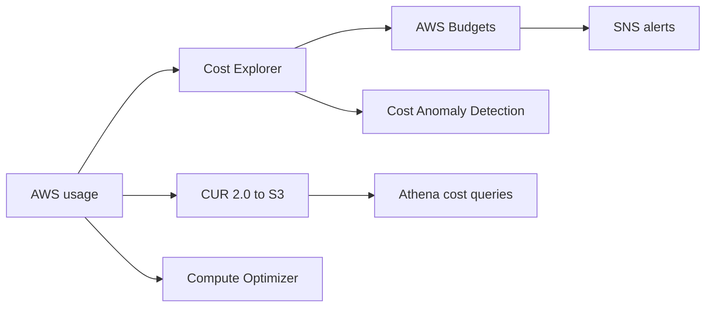

# Guardrails de Costo y Proteccion de Wallet

## Caso de uso

Evitar sorpresas de factura, abuso accidental, loops, ataques de consumo o workloads mal dimensionados.

## Decision principal

Activa **Budgets, Cost Anomaly Detection, Cost Explorer, tags, Compute Optimizer y CUR** antes de que el sistema crezca.

No confies en revisar la factura manualmente. El costo tambien es una senal de seguridad y arquitectura.

## Preguntas clave

- Cual es el presupuesto mensual por ambiente?
- Que tag identifica producto, equipo, ambiente y owner?
- Que servicio podria crecer sin limite?
- Que metrica de consumo dispara alerta temprana?
- Que accion automatica es segura y cual requiere aprobacion?
- Que costo unitario importa: por usuario, orden, request, GB?

## Por que estos servicios

- **Budgets**: umbrales y alertas.
- **Cost Anomaly Detection**: spikes inusuales.
- **Cost Explorer**: analisis por servicio/tag/cuenta.
- **CUR + Athena**: detalle line-item.
- **Compute Optimizer**: rightsizing.
- **Cost Optimization Hub**: recomendaciones agregadas.

## Pros

- Detecta problemas antes de fin de mes.
- Facilita ownership por tags.
- Permite decisiones con datos.
- Identifica recursos idle o sobredimensionados.
- Ayuda a prevenir wallet DoS accidental.

## Contras

- Budgets no es rate limiter tecnico.
- Acciones automaticas pueden romper produccion si no se disenan.
- Tags incompletos reducen visibilidad.
- Cost Explorer no siempre tiene datos inmediatos.
- Recomendaciones necesitan contexto.

## Alertas recomendadas

- Budget mensual por cuenta/ambiente.
- Budget de forecast al 80% y 100%.
- Anomaly Detection por servicio.
- Alarma por NAT Gateway bytes/costo estimado.
- Alarma por CloudWatch Logs growth.
- Alarma por SQS backlog o EventBridge loop.
- Service Quotas donde un limite protege el gasto.

## Guardrails practicos

- Tags obligatorios: `app`, `env`, `owner`, `cost-center`.
- Retencion de logs explicita.
- Lifecycle en S3 y snapshots.
- WAF rate-based rules para endpoints publicos.
- Throttling en API Gateway.
- Reserved concurrency en Lambda para limitar explosion.
- VPC endpoints para reducir NAT cuando aplique.

## Evolucion natural

- Si hay gasto estable: Savings Plans o RIs con analisis.
- Si hay recursos idle: Compute Optimizer y schedules.
- Si logs dominan: sampling, retencion y clases.
- Si DynamoDB on-demand se estabiliza: evaluar provisioned.
- Si Fargate corre continuo: Savings Plans o right-sizing.

## Ejercicio de practica

Define guardrails para una API publica: API throttling, WAF rate limit, Lambda reserved concurrency, budget, anomaly alert y dashboard de costo por request.

