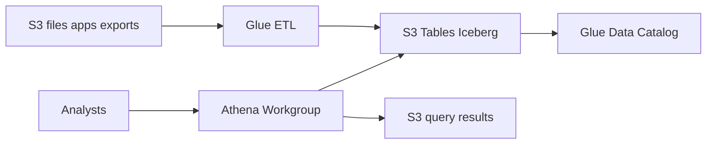

# Data Lake con S3 Tables, Glue y Athena

## Caso de uso

Equipo de analitica necesita consultar ventas, eventos, inventario y facturacion historica sin cargar la base transaccional.

## Decision principal

Usa **S3 Tables con Iceberg + Glue Catalog + Athena** para tablas analiticas administradas, historicas y consultables con SQL.

Usa **Aurora/RDS** para OLTP. Usa **Redshift** si necesitas warehouse con performance BI mas predecible y cargas agregadas. Usa **raw S3 Parquet** solo si aceptas administrar compactacion, evolucion de schema y metadatos con mas cuidado.

## Preguntas clave

- La carga es analitica o transaccional?
- Los datos llegan batch, streaming o ambos?
- Que particiones corresponden a tus queries?
- Necesitas schema evolution?
- Quien gobierna permisos: IAM, Lake Formation o ambos?
- Cuanto cuesta cada query por datos escaneados?

## Por que estos servicios

- **S3 Tables**: Iceberg administrado con compactacion/snapshots.
- **Glue Data Catalog**: catalogo para motores de consulta.
- **Athena**: SQL serverless.
- **Glue ETL**: cargas y transformaciones.
- **S3**: storage durable y barato.

## Pros

- Separa analytics de OLTP.
- Pago por uso para consultas.
- Abierto a motores compatibles con Iceberg.
- Buen fit para historico grande.
- Reduce carga sobre bases operacionales.

## Contras

- Latencia no es OLTP.
- Partitioning mal definido aumenta costo.
- Athena cobra por datos escaneados.
- Gobierno de permisos requiere diseno.
- ETL y calidad de datos no desaparecen.

## Alertas y costos

Minimo:

- Athena data scanned por workgroup.
- Glue job failures y duration.
- S3 storage growth.
- Query failures.
- Budget por S3, Athena y Glue.

Practicas:

- Workgroups con limites de bytes escaneados.
- Particionar por patrones de acceso, no por intuicion.
- Convertir CSV/JSON a Parquet/Iceberg.
- Validar row count, nulls criticos y muestras.

## Evolucion natural

- Si BI necesita baja latencia: Redshift o materializaciones.
- Si ingestion es streaming: Kinesis/Firehose hacia S3.
- Si hay CDC desde DB: Glue/DMS hacia Iceberg.
- Si hay muchos dominios: data products por namespace.
- Si queries son caras: compactacion, particiones y columnas.

## Ejercicio de practica

Disena tabla `sales_orders` en Iceberg. Define schema, particion, workgroup Athena, limite de bytes y validaciones de calidad.

