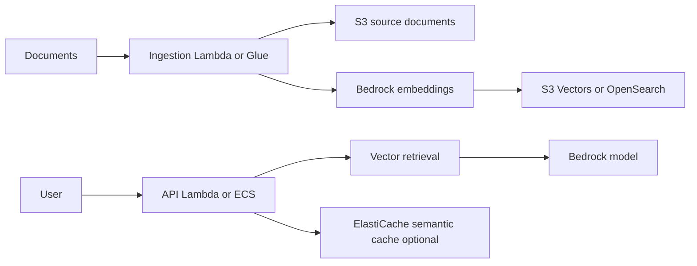

# RAG with Bedrock and Vector Stores

## Use case

Support application or internal agent answers questions using private documents, tickets, wikis, and knowledge bases.

## Main decision

Use **Bedrock + vector store** when you need grounding over private knowledge.

Use **S3 Vectors** for cost-effective vector storage and moderate queries. Use **OpenSearch** for high QPS, hybrid search, facets, or aggregations. Use **ElastiCache semantic cache** if repeated questions increase cost/latency.

## Key questions

- Which documents are the source of truth?
- How often do they change?
- Which embedding model and dimension will you use?
- Do you need filters by tenant, permission, or metadata?
- What is the expected QPS?
- Do you need to explain sources/citations?
- How will you prevent data leakage across tenants?

## Why these services

- **Bedrock**: managed models.
- **S3**: source documents.
- **S3 Vectors**: economical vector storage.
- **OpenSearch**: hybrid search and high throughput.
- **DynamoDB**: sessions and metadata.
- **ElastiCache**: semantic cache or agent memory.

## Pros

- Reduces need for initial fine-tuning.
- Documents remain updateable.
- Can grow by layers.
- Good serverless fit.
- Enables source traceability.

## Cons

- Quality depends on chunking and metadata.
- Token costs can grow quickly.
- Multi-tenant security is critical.
- Automated evaluation requires work.
- Latency can rise due to retrieval + generation.

## Alerts and cost

Minimum:

- p95/p99 latency for retrieval and generation.
- Bedrock throttling errors.
- Tokens/input-output per request.
- Cache hit rate if using semantic cache.
- Vector query errors.
- Budget for Bedrock, embeddings, vector store, and logs.

Guardrails:

- Tenant filters in metadata.
- Do not store prompts with secrets.
- Quality and safety evaluations.
- Rate limits per user/API key.
- Cost anomaly by model.

## Natural evolution

- If QPS rises: OpenSearch or cache.
- If token cost rises: prompt compression, caching, smaller model.
- If answers fail: improve chunking, metadata, and reranking.
- If data is sensitive: ABAC and tenant separation.
- If agents execute actions: IAM permissions per tool and audit.

## Practice exercise

Design RAG for an internal wiki. Define ingestion, chunking, permission metadata, vector store, budget per user, and quality metrics.

