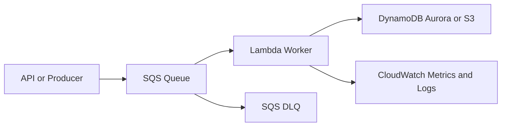
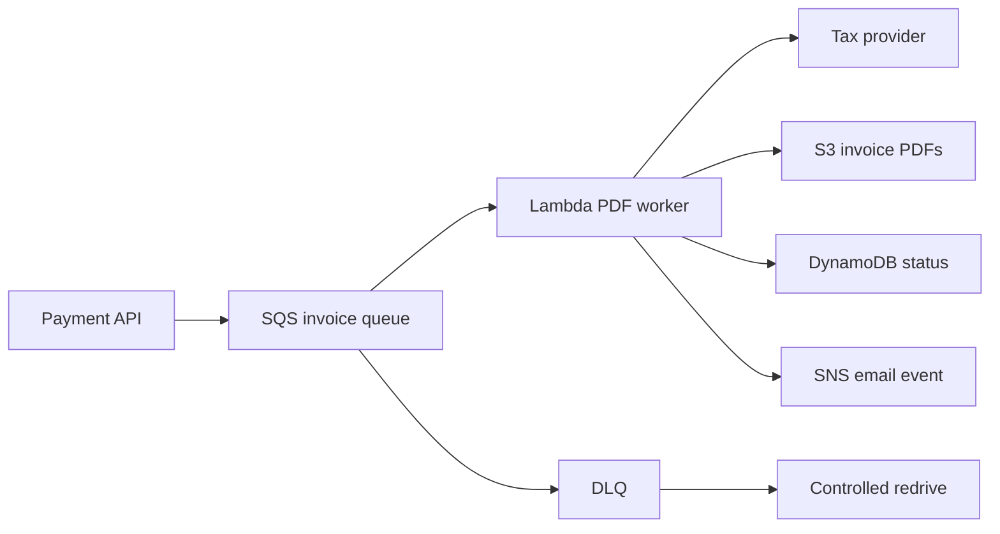

# Asynchronous Worker with SQS and Lambda

## Use case

Process work that does not need an immediate response: sending emails, generating PDFs, syncing inventory, deferred payment processing, or small batch jobs.

## Main decision

Use **SQS + Lambda** when you want to decouple producer and consumer, absorb spikes, and process messages with managed retries.

Use **SQS FIFO** if ordering by group or deduplication matters. Use **Kinesis/MSK** if you need replay, multiple independent consumers, or continuous high volume. Use an **ECS worker** if each task lasts more than 15 minutes or needs heavy binaries.

## Key questions

- Can the user wait, or do they only need an acknowledgment?
- Is the task idempotent?
- What happens if it is processed twice?
- Does ordering matter?
- How long does processing take at p95/p99?
- How will you handle poison messages?

## Why these services

- **SQS**: durable buffer with retries and DLQ.
- **Lambda event source mapping**: scales workers based on queue depth.
- **DLQ**: separates permanent failures.
- **CloudWatch alarms**: detects backlog and errors.

## Pros

- Decouples spikes.
- Reduces cascading failures.
- No worker administration.
- Easy to limit concurrency to protect downstreams.
- DLQ enables recovery.

## Cons

- At-least-once semantics require idempotency.
- Latency is not always immediate.
- No global ordering in SQS Standard.
- Large messages should go to S3.
- Debugging requires correlation IDs.

## Alerts and cost

Minimum:

- SQS ApproximateAgeOfOldestMessage.
- SQS ApproximateNumberOfMessagesVisible.
- DLQ depth > 0.
- Lambda Errors, Throttles, p99 Duration.
- ConcurrentExecutions against reserved limit.

Practical rules:

- Visibility timeout at least 6x the Lambda timeout.
- Enable partial batch failure reporting.
- Use reserved concurrency to protect databases.
- Explicit log retention.

## Natural evolution

- If you need fan-out: SNS or EventBridge before SQS.
- If you need orchestration: Step Functions.
- If you need replay and parallel consumers: Kinesis or MSK.
- If workers are CPU-heavy: ECS/Fargate.
- If backlog keeps growing: review downstream capacity and batch size.

## Applied Examples

### Example 1: Asynchronous PDF invoice generation

**Context:** A payments platform must generate invoice PDFs after payment, notify the customer, and retry when the tax provider fails.

**Questions and answers:**

- **Should the user wait for the PDF?** No. The API confirms payment and enqueues `InvoiceRequested`; the PDF arrives by email or appears in the portal.
- **What happens if the tax provider fails?** SQS handles retries, a DLQ stores poison messages, and processing is idempotent by `paymentId`.
- **How is the database protected?** Reserved concurrency limits Lambda, and the Visibility timeout is at least 6x the worker timeout.

**Architecture by stage:**

- **Initial project:** API Gateway or ECS publishes to SQS Standard, a Lambda worker generates PDFs, S3 stores documents, and DynamoDB tracks status.
- **Middle stage:** DLQ with controlled redrive, SNS for notifications, alarms on DLQ depth and p99 Duration, and Step Functions for flows with manual approval.
- **Large-scale projection:** Partition by tenant or region, use ECS workers if the PDF library is heavy, add S3 lifecycle retention, and feed a data lake for tax audit.

**Migration/evolution:** If the PDF is generated inside the request today, extract it behind a queue first while keeping the current endpoint and returning a `PROCESSING` state.

**Related patterns:** [pubsub-notifications-sns-sqs](../pubsub-notifications-sns-sqs/index.md), [workflow-orchestration-step-functions](../workflow-orchestration-step-functions/index.md), [file-processing-s3-stepfunctions](../file-processing-s3-stepfunctions/index.md).

## Practice exercise

Design a PDF invoice generation flow. Define queue, DLQ, idempotency key, alarms, and redrive strategy.

