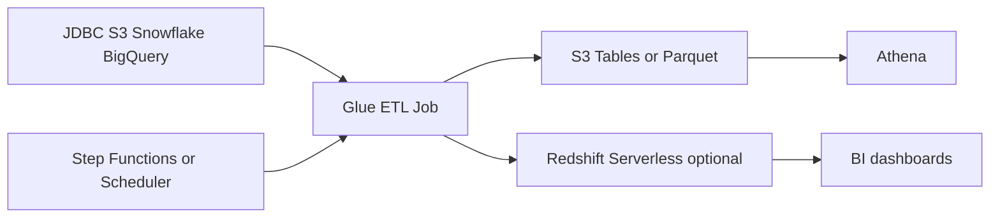
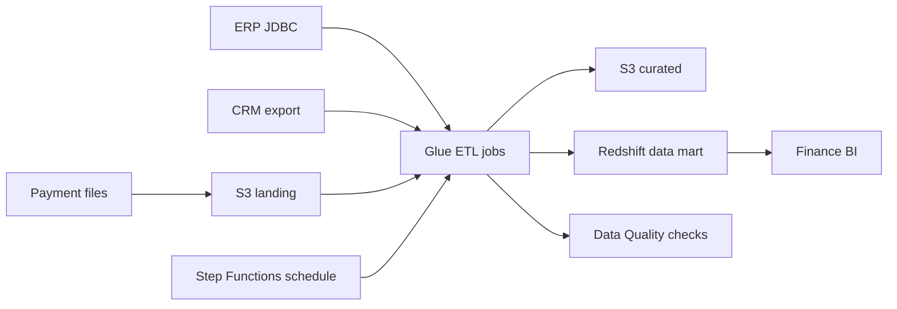

# Batch ETL with Glue and Redshift

## Use case

Every night, data is integrated from PostgreSQL, MySQL, S3, Snowflake, or BigQuery for reports, dashboards, and analytical models.

## Main decision

Use **Glue ETL** for managed batch extraction, transformation, and loading. Use **S3 Tables** as the default lakehouse destination and **Redshift** when you need a warehouse optimized for BI.

Use **Athena CTAS/INSERT** for small or simple loads. Use **Kinesis/Flink** if you need streaming. Use **MWAA** if you need complex DAGs with many dependencies.

## Key questions

- Is the load one-time, recurring, or incremental?
- Does the source already have a Glue connection?
- Do you need upsert/merge or append?
- What is the processing window?
- How do you validate counts and critical data?
- Does the final consumer use Athena or intensive BI?

## Why these services

- **Glue**: managed Spark, connectors, and jobs.
- **Step Functions/Scheduler**: orchestration and scheduling.
- **S3 Tables/Iceberg**: evolvable historical table.
- **Redshift**: fast BI queries and concurrency.
- **Glue Data Quality**: quality controls.

## Pros

- Reduces Spark cluster administration.
- Works with multiple sources.
- Can scale for large data.
- Allows validations before publishing.
- Integrates with catalog and Athena.

## Cons

- Spark jobs require tuning.
- JDBC connections and networks can fail.
- Not ideal for low latency.
- Costs grow with DPU and duration.
- Large upserts require Iceberg/warehouse design.

## Alerts and cost

Minimum:

- Glue job failed, timeout, duration.
- Data quality failed.
- Redshift query latency/concurrency if applicable.
- S3 storage growth.
- Budget for Glue DPU-hours, Redshift, and scanned data.

Guardrails:

- Validate source vs target row count.
- Null checks on critical columns.
- Watermarks for incremental loads.
- Separate raw, curated, and serving.

## Natural evolution

- If pipelines grow: MWAA or modular Step Functions.
- If consumption is only occasional SQL: Athena is enough.
- If dashboards suffer: Redshift/materialized views.
- If source schema changes: schema evolution and contracts.
- If data arrives continuously: streaming to lake.

## Applied Examples

### Example 1: Nightly financial data mart

**Context:** A company consolidates ERP, CRM, and external payment data every night for finance dashboards, cohorts, and monthly close.

**Questions and answers:**

- **Why batch and not streaming?** The business accepts daily data, sources are JDBC/SaaS, and scheduled Glue lowers operational cost.
- **When does Redshift enter?** When BI needs large joins, concurrency, and dimensional models faster than Athena over S3.
- **How is close validated?** Source/target counts, null checks, amount reconciliation, and alarms on job failures.

**Architecture by stage:**

- **Initial project:** Glue connections, PySpark jobs, S3 landing, Glue Data Catalog, Step Functions ordering, and Redshift Serverless or provisioned.
- **Middle stage:** Incremental loads by watermark, Glue Data Quality, SNS notifications, secrets in Secrets Manager, and budgets by workgroup/cluster.
- **Large-scale projection:** Historical data lake on S3 Tables, Redshift data sharing, multi-domain orchestration, and separate data accounts.

**Migration/evolution:** If cron scripts run on a VM today, move landing to S3 first, encapsulate transformations in Glue, then replace cron with Step Functions.

**Related patterns:** [data-lake-s3-tables-athena](../data-lake-s3-tables-athena/index.md), [workflow-orchestration-step-functions](../workflow-orchestration-step-functions/index.md), [security-iam-secrets-oidc](../security-iam-secrets-oidc/index.md).

## Practice exercise

Design incremental load of `orders` from PostgreSQL to S3 Tables. Define watermark, validation, retry, and final publication.

