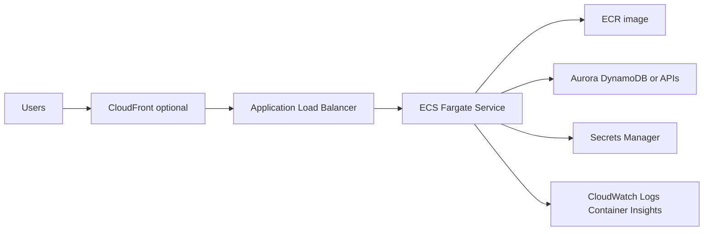
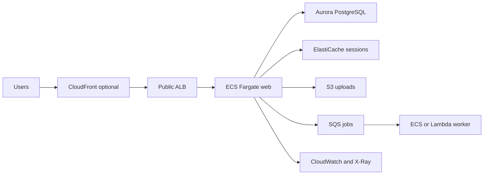

# Containerized Web App with ECS Fargate and ALB

## Use case

Web application or API packaged in Docker: Node.js, Java, Python, Go, or .NET. It needs public HTTP, configuration variables, secrets, horizontal scaling, and controlled deployments.

## Main decision

Use **ECS Fargate + ALB** for production HTTP workloads that need containers, runtime control, and fewer operations than EC2.

Use **ECS Express Mode** for a simple, fast HTTP app. Use **Lambda** if the workload is event-driven or sporadic. Use **EKS** only if you need Kubernetes, operators, or K8s portability.

## Key questions

- Does the app need a long-running process, sockets, workers, or heavy dependencies?
- Can it start quickly and answer health checks?
- Does it need a private VPC, secrets, and database connection?
- How many minimum replicas are required for availability?
- Is zero downtime required during deployment?
- Which metric scales best: CPU, memory, requests, or backlog?

## Why these services

- **ECS Fargate**: no host management.
- **ALB**: HTTP routing, TLS with ACM, and health checks.
- **ECR**: private registry with scanning.
- **Secrets Manager/SSM**: secrets injected into the task.
- **CloudWatch Container Insights**: container metrics.

## Pros

- Familiar for Docker teams.
- More runtime control than Lambda.
- Simple horizontal scaling.
- Deployments with circuit breaker and rollback.
- Works well with ALB, WAF, and CloudFront.

## Cons

- You always pay for minimum capacity.
- Private networking can introduce NAT costs.
- Large images slow down deployments.
- Bad health checks cause rollbacks.
- IAM is split between execution role and task role.

## Alerts and cost

Minimum:

- ALB 5xx, p99 target response time, unhealthy target count.
- ECS CPU, memory, task stopped, deployment rollback.
- Application log errors.
- Budget for Fargate, ALB, NAT Gateway, and logs.

Practices:

- `desiredCount=2` for high availability.
- `minimumHealthyPercent=100`, `maximumPercent=200` for zero downtime with one replica.
- Deployment circuit breaker with rollback.
- Deregistration delay 30-60s, not the default 300s if you do not need it.
- Health check grace period, especially for JVM/Spring.

## Natural evolution

- If traffic is irregular: split async workers with SQS.
- If there are scheduled tasks: EventBridge Scheduler + Scheduled Fargate Task.
- If you need canary traffic: native ECS blue/green.
- If NAT cost rises: create VPC endpoints for ECR, S3, logs, and Secrets Manager.
- If multiple services appear: Service Connect.

## Applied Examples

### Example 1: B2B SaaS with web app and monolithic API

**Context:** A contract-management SaaS has a Rails/Django app with small jobs, SQL data, and native dependencies that make a direct Lambda migration awkward.

**Questions and answers:**

- **Why containers from the start?** The runtime needs long processes, native libraries, and deployment control; ECS Fargate avoids operating EC2.
- **What belongs in private subnets?** ECS tasks, Aurora, ElastiCache, and workers. Only the public ALB receives external traffic.
- **How do we avoid slow or broken deploys?** Health check grace period, low deregistration delay, circuit breaker with rollback, and at least two tasks for zero downtime.

**Architecture by stage:**

- **Initial project:** Public ALB with ACM, ECS Fargate in private subnets, ECR, Aurora PostgreSQL, Secrets Manager, CloudWatch Logs, and WAF if internet-facing.
- **Middle stage:** ECS workers or SQS + Lambda for asynchronous jobs, autoscaling by CPU/request count, blue/green deployment, and VPC endpoints to reduce NAT cost.
- **Large-scale projection:** Split services by bounded context, use Service Connect, accounts per environment, read replicas or Aurora Serverless v2, and a data lake for analytics.

**Migration/evolution:** If the app comes from Heroku or one VM, containerize without rewriting, move sessions to ElastiCache, files to S3, then extract workers and APIs by domain.

**Related patterns:** [async-worker-sqs-lambda](../async-worker-sqs-lambda/index.md), [relational-sql-aurora-postgresql](../relational-sql-aurora-postgresql/index.md), [redis-cache-aside-elasticache](../redis-cache-aside-elasticache/index.md).

## Practice exercise

Take a Docker API and design ECR, task definition, ALB, security groups, Secrets Manager, alarms, and estimated monthly budget.

