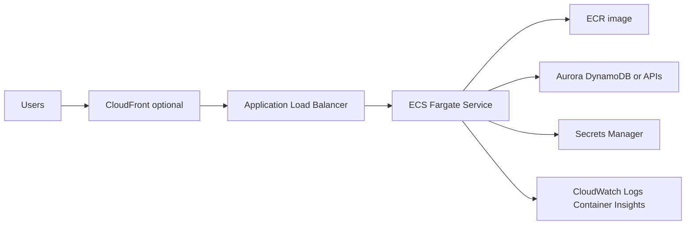

# Containerized Web App with ECS Fargate and ALB

## Use case

Web application or API packaged in Docker: Node.js, Java, Python, Go, or .NET. It needs public HTTP, configuration variables, secrets, horizontal scaling, and controlled deployments.

## Main decision

Use **ECS Fargate + ALB** for production HTTP workloads that need containers, runtime control, and fewer operations than EC2.

Use **ECS Express Mode** for a simple, fast HTTP app. Use **Lambda** if the workload is event-driven or sporadic. Use **EKS** only if you need Kubernetes, operators, or K8s portability.

## Key questions

- Does the app need a long-running process, sockets, workers, or heavy dependencies?
- Can it start quickly and answer health checks?
- Does it need a private VPC, secrets, and database connection?
- How many minimum replicas are required for availability?
- Is zero downtime required during deployment?
- Which metric scales best: CPU, memory, requests, or backlog?

## Why these services

- **ECS Fargate**: no host management.
- **ALB**: HTTP routing, TLS with ACM, and health checks.
- **ECR**: private registry with scanning.
- **Secrets Manager/SSM**: secrets injected into the task.
- **CloudWatch Container Insights**: container metrics.

## Pros

- Familiar for Docker teams.
- More runtime control than Lambda.
- Simple horizontal scaling.
- Deployments with circuit breaker and rollback.
- Works well with ALB, WAF, and CloudFront.

## Cons

- You always pay for minimum capacity.
- Private networking can introduce NAT costs.
- Large images slow down deployments.
- Bad health checks cause rollbacks.
- IAM is split between execution role and task role.

## Alerts and cost

Minimum:

- ALB 5xx, p99 target response time, unhealthy target count.
- ECS CPU, memory, task stopped, deployment rollback.
- Application log errors.
- Budget for Fargate, ALB, NAT Gateway, and logs.

Practices:

- `desiredCount=2` for high availability.
- `minimumHealthyPercent=100`, `maximumPercent=200` for zero downtime with one replica.
- Deployment circuit breaker with rollback.
- Deregistration delay 30-60s, not the default 300s if you do not need it.
- Health check grace period, especially for JVM/Spring.

## Natural evolution

- If traffic is irregular: split async workers with SQS.
- If there are scheduled tasks: EventBridge Scheduler + Scheduled Fargate Task.
- If you need canary traffic: native ECS blue/green.
- If NAT cost rises: create VPC endpoints for ECR, S3, logs, and Secrets Manager.
- If multiple services appear: Service Connect.

## Practice exercise

Take a Docker API and design ECR, task definition, ALB, security groups, Secrets Manager, alarms, and estimated monthly budget.

