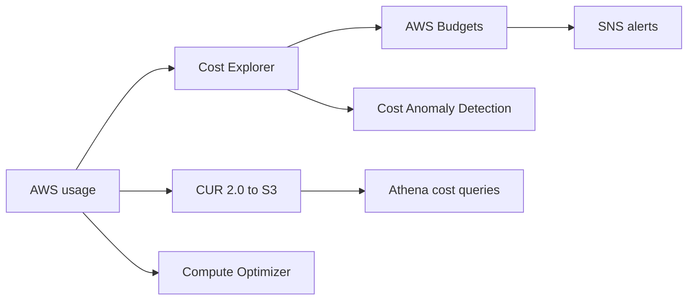
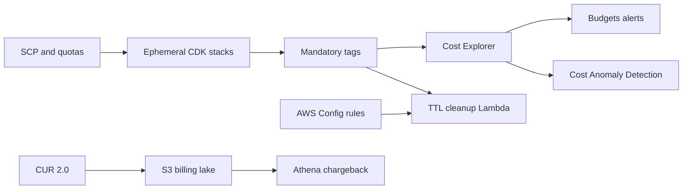

# Cost Guardrails and Wallet Protection

## Use case

Avoid billing surprises, accidental abuse, loops, consumption attacks, or poorly sized workloads.

## Main decision

Enable **Budgets, Cost Anomaly Detection, Cost Explorer, tags, Compute Optimizer, and CUR** before the system grows.

Do not rely on manually checking the bill. Cost is also a security and architecture signal.

## Key questions

- What is the monthly budget per environment?
- Which tag identifies product, team, environment, and owner?
- Which service could grow without a limit?
- Which consumption metric triggers early alerting?
- Which automatic action is safe, and which requires approval?
- Which unit cost matters: per user, order, request, GB?

## Why these services

- **Budgets**: thresholds and alerts.
- **Cost Anomaly Detection**: unusual spikes.
- **Cost Explorer**: analysis by service/tag/account.
- **CUR + Athena**: line-item detail.
- **Compute Optimizer**: rightsizing.
- **Cost Optimization Hub**: aggregated recommendations.

## Pros

- Detects problems before month-end.
- Enables ownership through tags.
- Supports data-driven decisions.
- Identifies idle or oversized resources.
- Helps prevent accidental wallet DoS.

## Cons

- Budgets are not a technical rate limiter.
- Automatic actions can break production if poorly designed.
- Incomplete tags reduce visibility.
- Cost Explorer is not always immediate.
- Recommendations need context.

## Recommended alerts

- Monthly budget by account/environment.
- Forecast budget at 80% and 100%.
- Anomaly Detection by service.
- Alarm for NAT Gateway bytes/estimated cost.
- Alarm for CloudWatch Logs growth.
- Alarm for SQS backlog or EventBridge loop.
- Service Quotas where a limit protects spend.

## Practical guardrails

- Required tags: `app`, `env`, `owner`, `cost-center`.
- Explicit log retention.
- Lifecycle on S3 and snapshots.
- WAF rate-based rules for public endpoints.
- API Gateway throttling.
- Lambda reserved concurrency to limit explosion.
- VPC endpoints to reduce NAT where applicable.

## Natural evolution

- If spend is stable: Savings Plans or RIs with analysis.
- If resources are idle: Compute Optimizer and schedules.
- If logs dominate: sampling, retention, and classes.
- If DynamoDB on-demand stabilizes: evaluate provisioned.
- If Fargate runs continuously: Savings Plans or right-sizing.

## Applied Examples

### Example 1: Startup with ephemeral environments per pull request

**Context:** Every pull request creates temporary stacks for testing. The team wants speed without discovering costs late.

**Questions and answers:**

- **Does a Budget stop spend?** No. It alerts; technical control comes from quotas, TTL, cleanup automation, and SCPs.
- **Which tags are mandatory?** `owner`, `env`, `project`, `ttl`, `cost-center`, and `created-by` for attribution and orphan cleanup.
- **Which signals trigger action?** Forecast above budget, anomaly detection, unusual NAT/DataTransfer, logs without retention, and untagged resources.

**Architecture by stage:**

- **Initial project:** Budgets by account/environment, Cost Anomaly Detection, mandatory tags in IaC, and daily spend alarms.
- **Middle stage:** Lambda Scheduler deletes expired stacks, AWS Config detects missing tags/log retention, Service Quotas limits expensive services, and Cost Explorer dashboards.
- **Large-scale projection:** CUR 2.0 in S3 + Athena, chargeback by team, SCPs by OU, and Savings Plans evaluated from data with finance approval.

**Migration/evolution:** If no tagging exists, start with new stacks, backfill live resources next, and finally block pipeline deploys without tags.

**Related patterns:** [security-iam-secrets-oidc](../security-iam-secrets-oidc/index.md), [observability-cloudwatch-xray-adot](../observability-cloudwatch-xray-adot/index.md), [multi-account-networking-vpc-endpoints](../multi-account-networking-vpc-endpoints/index.md).

## Practice exercise

Define guardrails for a public API: API throttling, WAF rate limit, Lambda reserved concurrency, budget, anomaly alert, and cost-per-request dashboard.

