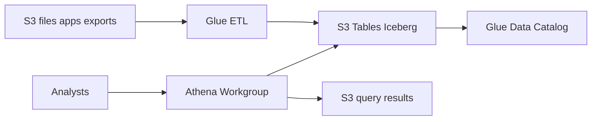
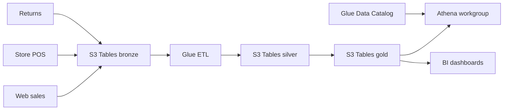

# Data Lake with S3 Tables, Glue, and Athena

## Use case

An analytics team needs to query historical sales, events, inventory, and billing without loading the transactional database.

## Main decision

Use **S3 Tables with Iceberg + Glue Catalog + Athena** for managed analytical, historical tables queryable with SQL.

Use **Aurora/RDS** for OLTP. Use **Redshift** if you need a warehouse with more predictable BI performance and aggregated workloads. Use **raw S3 Parquet** only if you accept managing compaction, schema evolution, and metadata more carefully.

## Key questions

- Is the workload analytical or transactional?
- Does data arrive by batch, streaming, or both?
- Which partitions match your queries?
- Do you need schema evolution?
- Who governs permissions: IAM, Lake Formation, or both?
- How much does each query cost by scanned data?

## Why these services

- **S3 Tables**: managed Iceberg with compaction/snapshots.
- **Glue Data Catalog**: catalog for query engines.
- **Athena**: serverless SQL.
- **Glue ETL**: loads and transformations.
- **S3**: durable and low-cost storage.

## Pros

- Separates analytics from OLTP.
- Pay-per-use queries.
- Open to Iceberg-compatible engines.
- Good fit for large history.
- Reduces load on operational databases.

## Cons

- Latency is not OLTP.
- Poor partitioning increases cost.
- Athena charges by scanned data.
- Permission governance requires design.
- ETL and data quality still matter.

## Alerts and cost

Minimum:

- Athena data scanned per workgroup.
- Glue job failures and duration.
- S3 storage growth.
- Query failures.
- Budget for S3, Athena, and Glue.

Practices:

- Workgroups with scanned-byte limits.
- Partition by access patterns, not intuition.
- Convert CSV/JSON to Parquet/Iceberg.
- Validate row count, critical nulls, and samples.

## Natural evolution

- If BI needs low latency: Redshift or materializations.
- If ingestion is streaming: Kinesis/Firehose to S3.
- If there is CDC from DB: Glue/DMS to Iceberg.
- If there are many domains: data products by namespace.
- If queries are expensive: compaction, partitions, and columns.

## Applied Examples

### Example 1: Omnichannel sales Lakehouse

**Context:** A brand combines web sales, physical stores, returns, and campaigns for daily reporting and ad hoc exploration.

**Questions and answers:**

- **Why S3 Tables and Iceberg?** The workload needs tables with schema evolution, partitions, and managed maintenance on S3 without operating clusters.
- **What are bronze, silver, and gold?** Bronze receives raw data, silver normalizes sales/returns, and gold aggregates KPIs by channel and day.
- **How is Athena cost controlled?** Parquet, partitions by date/channel, compaction, workgroups with limits, and budgets.

**Architecture by stage:**

- **Initial project:** S3 Tables, Glue Data Catalog, Athena workgroup, Glue jobs to load CSV/Parquet, and Lake Formation/IAM permissions.
- **Middle stage:** Incremental ingest from Aurora/DynamoDB, quality checks, QuickSight/Redshift Spectrum, and catalogs by domain.
- **Large-scale projection:** S3 Tables by domain, producer/consumer accounts, Flink streaming to Iceberg, and governance with sensitive-data tags.

**Migration/evolution:** If reports run on OLTP today, export tables to S3, recreate reports in Athena, and remove heavy queries from the transactional database.

**Related patterns:** [batch-etl-glue-redshift](../batch-etl-glue-redshift/index.md), [streaming-kinesis-realtime-analytics](../streaming-kinesis-realtime-analytics/index.md), [cost-guardrails-budgets-anomaly](../cost-guardrails-budgets-anomaly/index.md).

## Practice exercise

Design the `sales_orders` table in Iceberg. Define schema, partitioning, Athena workgroup, byte limit, and quality validations.

