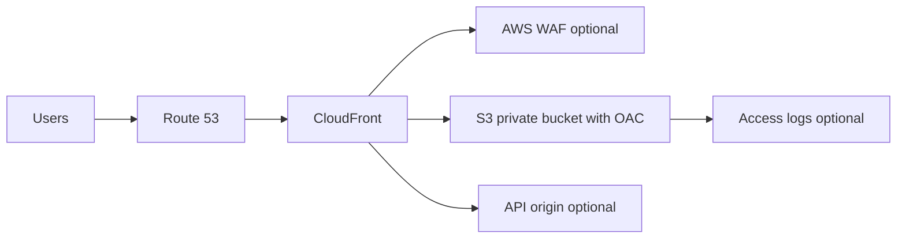

# Edge Static Site with CloudFront and S3

## Use case

SPA frontend, documentation, landing page, or public portal that must load fast globally with TLS, custom domain, and a non-public bucket.

## Main decision

Use **CloudFront + private S3 + Origin Access Control** for global static sites.

Use **Amplify Hosting** if you want a managed frontend flow with builds, previews, and branches. Use **ECS/Lambda** if there is heavy server-side rendering or dynamic backend. Use **API Gateway/ALB** as additional origins for APIs.

## Key questions

- Is it static site, SPA, or SSR?
- Do you need previews by branch?
- What cache/invalidation strategy will you use?
- Are there APIs under the same domain?
- Do you need WAF or rate limiting?
- How do you avoid a public bucket?

## Why these services

- **CloudFront**: global CDN and TLS.
- **S3**: cheap and durable origin.
- **OAC**: private access to the bucket.
- **Route 53 + ACM**: domain and certificates.
- **WAF**: edge protection.

## Pros

- Very low cost for static content.
- High global performance.
- Bucket can remain private.
- Easy to add WAF and headers.
- Good fit for SPAs.

## Cons

- Invalidations require care.
- SSR does not fit without additional compute.
- Bad cache settings serve stale content.
- Logs can grow in cost.
- CORS/API auth remain separate concerns.

## Alerts and cost

Minimum:

- CloudFront 4xx/5xx error rate.
- Origin latency.
- WAF blocked requests.
- S3 4xx/5xx.
- Budget for data transfer, invalidations, and logs.

Guardrails:

- Block Public Access on S3.
- Bucket policy only for CloudFront OAC.
- HTTPS redirect.
- Security headers.
- Lifecycle/retention for logs.

## Natural evolution

- If there is SSR: evaluate Amplify, Lambda@Edge, or containers.
- If APIs grow: separate API origin and auth.
- If consumption attacks happen: WAF rate-based rules.
- If assets are heavy: optimization and cache policies.
- If backend is multi-region: origins with failover.

## Practice exercise

Design deployment of an SPA with private bucket, CloudFront, Route 53, ACM, WAF rate rule, and automatic invalidation.

