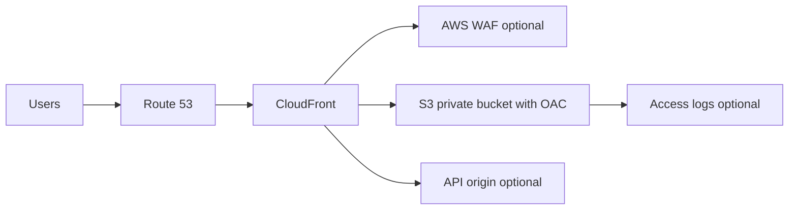

# Static Site Edge con CloudFront y S3

## Caso de uso

Frontend SPA, documentacion, landing o portal publico que debe cargar rapido globalmente con TLS, dominio propio y bucket no publico.

## Decision principal

Usa **CloudFront + S3 privado + Origin Access Control** para sitios estaticos globales.

Usa **Amplify Hosting** si quieres flujo frontend administrado con builds, previews y ramas. Usa **ECS/Lambda** si hay render server-side pesado o backend dinamico. Usa **API Gateway/ALB** como origins adicionales para APIs.

## Preguntas clave

- Es sitio estatico, SPA o SSR?
- Necesitas previews por branch?
- Que estrategia de cache/invalidation usaras?
- Hay APIs bajo el mismo dominio?
- Necesitas WAF o rate limiting?
- Como evitas bucket publico?

## Por que estos servicios

- **CloudFront**: CDN global y TLS.
- **S3**: origen barato y durable.
- **OAC**: acceso privado al bucket.
- **Route 53 + ACM**: dominio y certificados.
- **WAF**: proteccion de borde.

## Pros

- Muy bajo costo para estatico.
- Alto rendimiento global.
- Bucket puede permanecer privado.
- Facil agregar WAF y headers.
- Buen fit para SPAs.

## Contras

- Invalidaciones requieren cuidado.
- SSR no encaja sin computo adicional.
- Cache mal configurado sirve contenido viejo.
- Logs pueden crecer en costo.
- CORS/API auth siguen siendo temas aparte.

## Alertas y costos

Minimo:

- CloudFront 4xx/5xx error rate.
- Origin latency.
- WAF blocked requests.
- S3 4xx/5xx.
- Budget por data transfer, invalidations y logs.

Guardrails:

- Block Public Access en S3.
- Bucket policy solo para CloudFront OAC.
- HTTPS redirect.
- Security headers.
- Lifecycle/retention para logs.

## Evolucion natural

- Si hay SSR: evaluar Amplify, Lambda@Edge o contenedores.
- Si APIs crecen: separar API origin y auth.
- Si ataques de consumo: WAF rate-based rules.
- Si assets son pesados: optimizacion y cache policies.
- Si multi-region backend: origins con failover.

## Ejercicio de practica

Disena deployment de una SPA con bucket privado, CloudFront, Route 53, ACM, WAF rate rule e invalidacion automatica.

