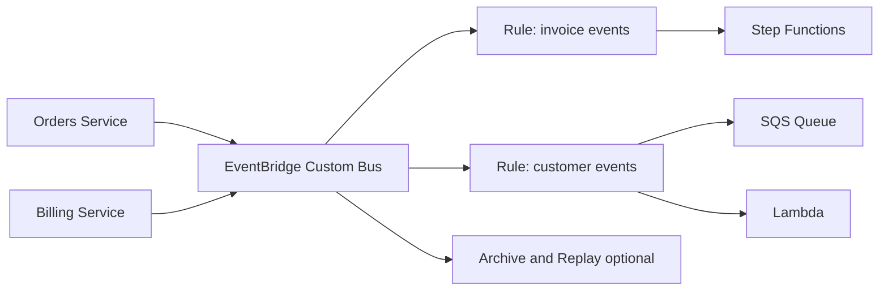

# Event-Driven Domain Bus with EventBridge

## Use case

A SaaS platform publishes domain events: `OrderCreated`, `InvoicePaid`, `UserUpgraded`. Different teams consume events without coupling to the source service.

## Main decision

Use **EventBridge** when events represent domain facts and you need content-based routing, AWS/SaaS integration, or buses separated by context.

Use **SNS** if fan-out is simple and topic-based. Use **SQS** if there is only one consumer. Use **MSK/Kinesis** if you need high-volume log replay and offset-based consumers.

## Key questions

- Is the event a domain fact or a work command?
- Do you need filters by payload fields?
- Do consumers belong to other teams/accounts?
- Do you need archive/replay?
- What event versioning will you use?
- How will you avoid event loops?

## Why these services

- **Custom event bus**: separates domains and permissions.
- **Rules**: declarative content-based routing.
- **Pipes**: source-to-target integrations without intermediate Lambda.
- **DLQ per target**: visible errors.
- **Schema registry**: documents contracts.

## Pros

- Organizational decoupling.
- Easy to add consumers.
- Good cross-account fit.
- Reduces glue Lambdas.
- Compatible with many AWS services.

## Cons

- Does not replace high-volume streaming.
- Broad patterns can cause loops.
- Event versioning requires discipline.
- Debugging depends on correlation IDs.
- Payload size and throughput must be checked.

## Alerts and cost

Minimum:

- FailedInvocations per rule.
- DLQ depth per target.
- Unexpected invocations from overly broad patterns.
- Budget for published events and targets.

Guardrails:

- Dedicated bus per domain.
- Specific event patterns.
- DLQ on important targets.
- `aws:SourceArn` and `aws:SourceAccount` in policies to SQS/SNS.

## Natural evolution

- If you need long replay and ordering: Kinesis/MSK.
- If rules become workflows: Step Functions.
- If one consumer is slow: put SQS between rule and worker.
- If events cross accounts: define schema ownership.
- If cost rises due to noise: review patterns and duplicate events.

## Practice exercise

Define a `commerce` bus. Publish `OrderCreated` and create rules for fulfillment, analytics, and email. Add DLQ and versioned schema.

