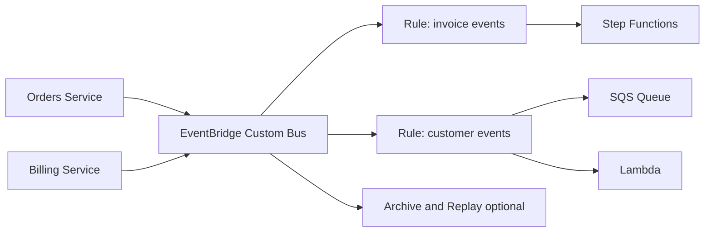
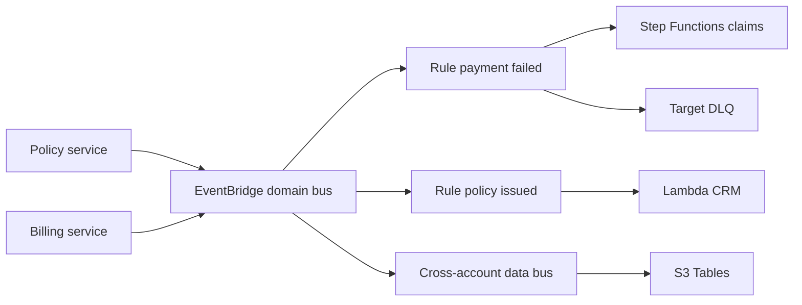

# Event-Driven Domain Bus with EventBridge

## Use case

A SaaS platform publishes domain events: `OrderCreated`, `InvoicePaid`, `UserUpgraded`. Different teams consume events without coupling to the source service.

## Main decision

Use **EventBridge** when events represent domain facts and you need content-based routing, AWS/SaaS integration, or buses separated by context.

Use **SNS** if fan-out is simple and topic-based. Use **SQS** if there is only one consumer. Use **MSK/Kinesis** if you need high-volume log replay and offset-based consumers.

## Key questions

- Is the event a domain fact or a work command?
- Do you need filters by payload fields?
- Do consumers belong to other teams/accounts?
- Do you need archive/replay?
- What event versioning will you use?
- How will you avoid event loops?

## Why these services

- **Custom event bus**: separates domains and permissions.
- **Rules**: declarative content-based routing.
- **Pipes**: source-to-target integrations without intermediate Lambda.
- **DLQ per target**: visible errors.
- **Schema registry**: documents contracts.

## Pros

- Organizational decoupling.
- Easy to add consumers.
- Good cross-account fit.
- Reduces glue Lambdas.
- Compatible with many AWS services.

## Cons

- Does not replace high-volume streaming.
- Broad patterns can cause loops.
- Event versioning requires discipline.
- Debugging depends on correlation IDs.
- Payload size and throughput must be checked.

## Alerts and cost

Minimum:

- FailedInvocations per rule.
- DLQ depth per target.
- Unexpected invocations from overly broad patterns.
- Budget for published events and targets.

Guardrails:

- Dedicated bus per domain.
- Specific event patterns.
- DLQ on important targets.
- `aws:SourceArn` and `aws:SourceAccount` in policies to SQS/SNS.

## Natural evolution

- If you need long replay and ordering: Kinesis/MSK.
- If rules become workflows: Step Functions.
- If one consumer is slow: put SQS between rule and worker.
- If events cross accounts: define schema ownership.
- If cost rises due to noise: review patterns and duplicate events.

## Applied Examples

### Example 1: Insurance platform with policy events

**Context:** Sales, billing, claims, and analytics need to react to policy changes without direct service-to-service calls between teams.

**Questions and answers:**

- **Is the event a business fact or a command?** `PolicyIssued` and `PaymentFailed` are facts; commands such as recalculate risk go through SQS or Step Functions.
- **Why EventBridge instead of SNS?** The workload needs content-based routing, domain buses, SaaS integrations, and selective archive/replay.
- **How are loops avoided?** Strict event patterns, domain-specific `source`, one rule per target, and a DLQ per target.

**Architecture by stage:**

- **Initial project:** `insurance-domain` bus, rules for billing and CRM, Lambda targets, and a documented schema registry.
- **Middle stage:** EventBridge Pipes from DynamoDB Streams, Step Functions for claims, cross-account bus for the data platform, and alarms on failed invocations.
- **Large-scale projection:** Buses by domain, archive/replay to rebuild projections, versioned contracts, and separate accounts for critical producers and consumers.

**Migration/evolution:** If services call each other in chains today, publish events after the transaction commits and move consumers to EventBridge rules without breaking the existing synchronous flow.

**Related patterns:** [workflow-orchestration-step-functions](../workflow-orchestration-step-functions/index.md), [nosql-dynamodb-single-table](../nosql-dynamodb-single-table/index.md), [data-lake-s3-tables-athena](../data-lake-s3-tables-athena/index.md).

## Practice exercise

Define a `commerce` bus. Publish `OrderCreated` and create rules for fulfillment, analytics, and email. Add DLQ and versioned schema.

