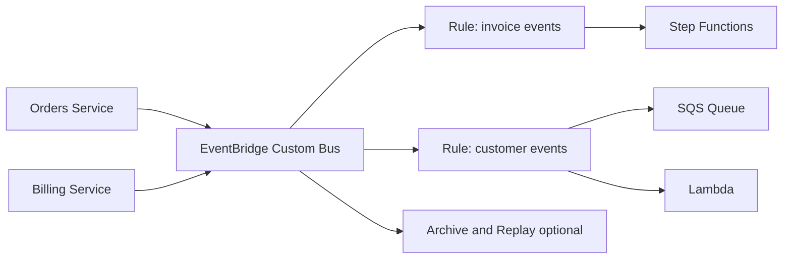

# Event-Driven Domain Bus con EventBridge

## Caso de uso

Una plataforma SaaS publica eventos de dominio: `OrderCreated`, `InvoicePaid`, `UserUpgraded`. Distintos equipos consumen eventos sin acoplarse al servicio origen.

## Decision principal

Usa **EventBridge** cuando los eventos representan hechos de dominio y necesitas routing por contenido, integracion con AWS/SaaS o buses separados por contexto.

Usa **SNS** si el fan-out es simple y por topic. Usa **SQS** si hay un solo consumidor. Usa **MSK/Kinesis** si necesitas log replay de alto volumen y consumidores por offset.

## Preguntas clave

- El evento es un hecho de dominio o una orden de trabajo?
- Necesitas filtros por campos del payload?
- Los consumidores pertenecen a otros equipos/cuentas?
- Necesitas archive/replay?
- Que versionado de eventos usaras?
- Como evitaras loops de eventos?

## Por que estos servicios

- **Custom event bus**: separa dominios y permisos.
- **Rules**: routing declarativo por contenido.
- **Pipes**: conecta source-target sin Lambda intermedia.
- **DLQ por target**: errores visibles.
- **Schema registry**: documenta contratos.

## Pros

- Desacoplamiento organizacional.
- Facil agregar consumidores.
- Buen fit cross-account.
- Reduce Lambdas "pegamento".
- Compatible con muchos servicios AWS.

## Contras

- No reemplaza streaming de alto volumen.
- Patrones amplios pueden causar loops.
- El versionado de eventos requiere disciplina.
- Debugging depende de correlation IDs.
- Payload maximo y throughput deben revisarse.

## Alertas y costos

Minimo:

- FailedInvocations por rule.
- DLQ depth por target.
- Invocations inesperadas por patron demasiado amplio.
- Budget por eventos publicados y targets.

Guardrails:

- Bus dedicado por dominio.
- Event pattern especifico.
- DLQ en targets importantes.
- `aws:SourceArn` y `aws:SourceAccount` en politicas hacia SQS/SNS.

## Evolucion natural

- Si hay necesidad de replay largo y orden: Kinesis/MSK.
- Si reglas se vuelven workflows: Step Functions.
- Si hay un consumidor lento: poner SQS entre rule y worker.
- Si eventos cruzan cuentas: definir owner del schema.
- Si el costo sube por ruido: revisar patrones y eventos duplicados.

## Ejercicio de practica

Define un bus `commerce`. Publica `OrderCreated` y crea reglas para fulfillment, analytics y email. Agrega DLQ y schema versionado.

