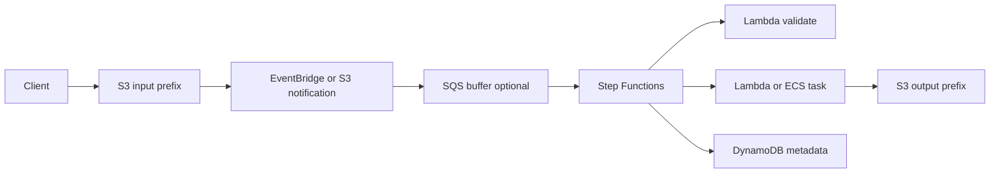
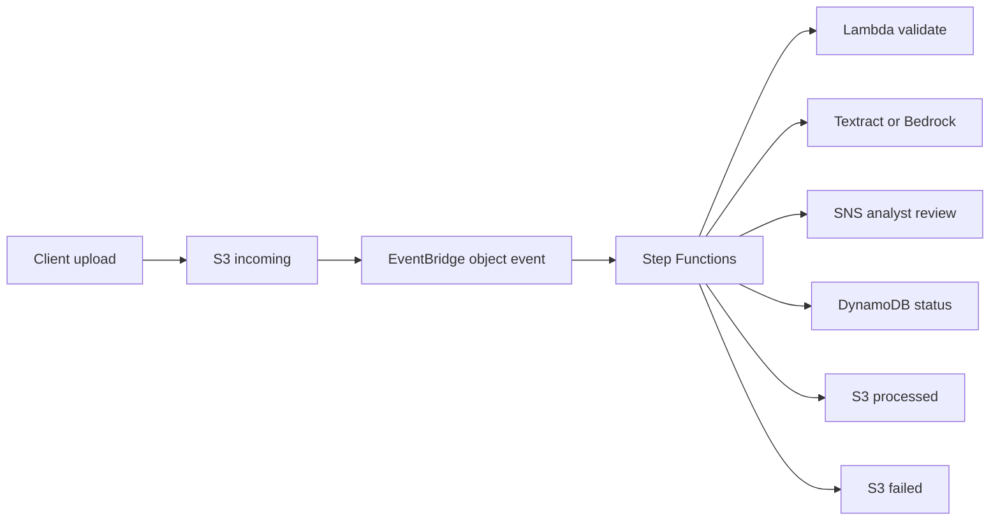

# File Processing with S3 and Step Functions

## Use case

Users upload images, CSVs, PDFs, or videos. The system validates, transforms, extracts metadata, and publishes results.

## Main decision

Use **S3 + EventBridge/SQS + Lambda/Step Functions** when a file triggers a flow with validation, transformation, and visible states.

Use **S3 -> Lambda directly** if it is a small, simple transformation. Use **Glue** for large ETL. Use **ECS Batch/Fargate** if processing exceeds Lambda or requires heavy binaries.

## Key questions

- Can the file be processed in less than 15 minutes?
- Do you need several steps or only one function?
- What is the maximum file size?
- How do you avoid recursive invocation?
- What happens with corrupt files?
- Do you need idempotency by object key/version?

## Why these services

- **S3**: durable and low-cost storage.
- **EventBridge**: flexible routing for S3 events.
- **SQS**: buffer and concurrency control.
- **Step Functions**: steps, retries, and errors.
- **DynamoDB**: state/metadata by file.

## Pros

- Scales by events.
- S3 separates input and output.
- DLQ and reprocessing are possible.
- State is visible if you use Step Functions.
- Lifecycle policies reduce cost.

## Cons

- Events can duplicate.
- Recursion if writing to the same prefix.
- Large files require streaming or jobs.
- Step Functions adds per-state cost.
- S3/KMS permissions can be delicate.

## Alerts and cost

Minimum:

- SQS backlog and DLQ depth.
- Lambda Errors/p99 Duration.
- Step Functions failed/timed out.
- S3 4xx/5xx if applicable.
- Budget for storage, requests, transitions, and logs.

Guardrails:

- Separate `input/`, `processing/`, `output/`, and `failed/` prefixes.
- Never write output to the triggering prefix.
- Enable S3 encryption, versioning, and block public access.
- Define lifecycle for temporary files.

## Natural evolution

- If there are large batches: Glue.
- If there is video/media: MediaConvert or ECS tasks.
- If approval is needed: Step Functions waitForTaskToken.
- If metadata grows: DynamoDB + OpenSearch for search.
- If data is tabular: convert to S3 Tables/Iceberg.

## Applied Examples

### Example 1: Credit document processing

**Context:** Customers upload PDFs, images, and forms. The system must validate format, extract data, check rules, and notify an analyst.

**Questions and answers:**

- **Why not process directly from an S3 trigger?** The flow has steps, branches, retries, and large files; Step Functions makes state visible and S3 stores payloads.
- **How is recursion avoided?** Separate buckets or prefixes for `incoming`, `processed`, and `failed`; output never writes to the same prefix that triggers input.
- **Which errors are retried?** OCR/external API failures with backoff; corrupt files go to a rejection branch and operational DLQ.

**Architecture by stage:**

- **Initial project:** S3 receives upload through Presigned URL, EventBridge triggers Step Functions, Lambda validates, extracts metadata, and updates DynamoDB.
- **Middle stage:** Textract/Bedrock for extraction, SQS buffer for spikes, antivirus in Lambda/ECS, and SNS notifications to analysts.
- **Large-scale projection:** Distributed Map for batches, queues by document type, S3 lifecycle/retention, and a Lakehouse for training and audit.

**Migration/evolution:** If a cron job processes shared folders today, replicate files to S3, keep state in DynamoDB, and move validations into the workflow stage by stage.

**Related patterns:** [workflow-orchestration-step-functions](../workflow-orchestration-step-functions/index.md), [ai-rag-bedrock-vectors](../ai-rag-bedrock-vectors/index.md), [data-lake-s3-tables-athena](../data-lake-s3-tables-athena/index.md).

## Practice exercise

Design a sales CSV pipeline. Validate schema, transform to Parquet, store metadata, and define error routing.

