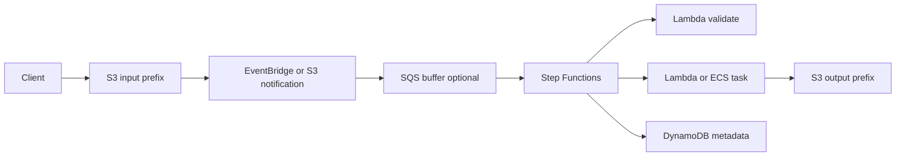
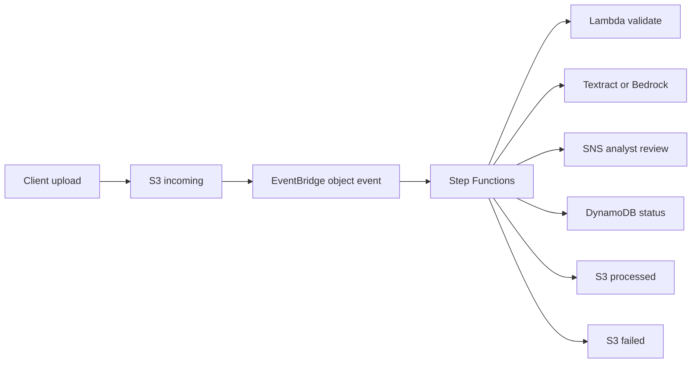

# Procesamiento de Archivos con S3 y Step Functions

## Caso de uso

Usuarios suben imagenes, CSV, PDFs o videos. El sistema valida, transforma, extrae metadata y publica resultados.

## Decision principal

Usa **S3 + EventBridge/SQS + Lambda/Step Functions** cuando el archivo dispara un flujo con validacion, transformacion y estados visibles.

Usa **S3 -> Lambda directo** si es una transformacion pequena y simple. Usa **Glue** si es ETL grande. Usa **ECS Batch/Fargate** si el procesamiento supera Lambda o requiere binarios pesados.

## Preguntas clave

- El archivo puede procesarse en menos de 15 minutos?
- Necesitas varios pasos o solo una funcion?
- Que tamano maximo tiene el archivo?
- Como evitas invocacion recursiva?
- Que pasa con archivos corruptos?
- Necesitas idempotencia por object key/version?

## Por que estos servicios

- **S3**: almacenamiento durable y barato.
- **EventBridge**: routing flexible de eventos S3.
- **SQS**: buffer y control de concurrencia.
- **Step Functions**: pasos, retries y errores.
- **DynamoDB**: estado/metadata por archivo.

## Pros

- Escala por eventos.
- S3 separa input y output.
- DLQ y reprocessing posibles.
- Estado visible si usas Step Functions.
- Lifecycle policies reducen costo.

## Contras

- Eventos pueden duplicarse.
- Recursion si escribes en mismo prefix.
- Archivos grandes requieren streaming o jobs.
- Step Functions agrega costo por estado.
- Permisos S3/KMS pueden ser delicados.

## Alertas y costos

Minimo:

- SQS backlog y DLQ depth.
- Lambda Errors/Duration p99.
- Step Functions failed/timed out.
- S3 4xx/5xx si aplica.
- Budget por storage, requests, transitions y logs.

Guardrails:

- Separar prefixes `input/`, `processing/`, `output/`, `failed/`.
- Nunca escribir output en el prefix que dispara.
- Activar S3 encryption, versioning y block public access.
- Definir lifecycle para temporales.

## Evolucion natural

- Si hay lotes grandes: Glue.
- Si hay video/media: MediaConvert o ECS tasks.
- Si necesitas aprobacion: Step Functions waitForTaskToken.
- Si metadata crece: DynamoDB + OpenSearch para busqueda.
- Si hay datos tabulares: convertir a S3 Tables/Iceberg.

## Ejemplos aplicados

### Ejemplo 1: Procesamiento de documentos de credito

**Contexto:** Clientes suben PDFs, imagenes y formularios. El sistema debe validar formato, extraer datos, revisar reglas y avisar al analista.

**Preguntas y respuestas:**

- **Por que no procesar directo en S3 trigger?** El flujo tiene pasos, ramas, retries y archivos grandes; Step Functions hace visible el estado y S3 guarda payloads.
- **Como evitar recursion?** Buckets o prefixes separados para `incoming`, `processed` y `failed`; la salida nunca escribe al mismo prefix que dispara entrada.
- **Que errores se reintentan?** OCR/API externo con backoff; archivos corruptos van a una rama de rechazo y DLQ operacional.

**Diseno por etapa:**

- **Proyecto inicial:** S3 recibe upload con Presigned URL, EventBridge dispara Step Functions, Lambda valida, extrae metadatos y actualiza DynamoDB.
- **Etapa media:** Textract/Bedrock para extraccion, SQS buffer para picos, antivirus en Lambda/ECS y notificaciones SNS al analista.
- **Gran escala:** Distributed Map para lotes, colas por tipo de documento, S3 lifecycle/retention, Lakehouse para entrenamiento y auditoria.

**Migracion/evolucion:** Si un cron procesa carpetas compartidas, replicar archivos a S3, mantener estado en DynamoDB y mover validaciones por etapas al workflow.

**Patrones relacionados:** [workflow-orchestration-step-functions](../workflow-orchestration-step-functions/index.md), [ai-rag-bedrock-vectors](../ai-rag-bedrock-vectors/index.md), [data-lake-s3-tables-athena](../data-lake-s3-tables-athena/index.md).

## Ejercicio de practica

Disena pipeline para CSV de ventas. Valida schema, transforma a Parquet, guarda metadata y define ruta de errores.

