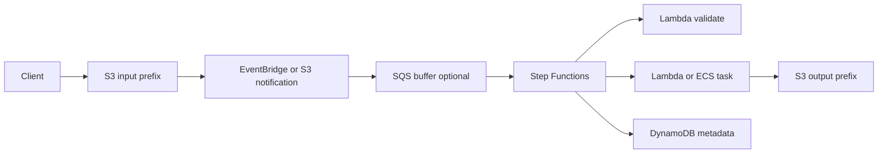

# Procesamiento de Archivos con S3 y Step Functions

## Caso de uso

Usuarios suben imagenes, CSV, PDFs o videos. El sistema valida, transforma, extrae metadata y publica resultados.

## Decision principal

Usa **S3 + EventBridge/SQS + Lambda/Step Functions** cuando el archivo dispara un flujo con validacion, transformacion y estados visibles.

Usa **S3 -> Lambda directo** si es una transformacion pequena y simple. Usa **Glue** si es ETL grande. Usa **ECS Batch/Fargate** si el procesamiento supera Lambda o requiere binarios pesados.

## Preguntas clave

- El archivo puede procesarse en menos de 15 minutos?
- Necesitas varios pasos o solo una funcion?
- Que tamano maximo tiene el archivo?
- Como evitas invocacion recursiva?
- Que pasa con archivos corruptos?
- Necesitas idempotencia por object key/version?

## Por que estos servicios

- **S3**: almacenamiento durable y barato.
- **EventBridge**: routing flexible de eventos S3.
- **SQS**: buffer y control de concurrencia.
- **Step Functions**: pasos, retries y errores.
- **DynamoDB**: estado/metadata por archivo.

## Pros

- Escala por eventos.
- S3 separa input y output.
- DLQ y reprocessing posibles.
- Estado visible si usas Step Functions.
- Lifecycle policies reducen costo.

## Contras

- Eventos pueden duplicarse.
- Recursion si escribes en mismo prefix.
- Archivos grandes requieren streaming o jobs.
- Step Functions agrega costo por estado.
- Permisos S3/KMS pueden ser delicados.

## Alertas y costos

Minimo:

- SQS backlog y DLQ depth.
- Lambda Errors/Duration p99.
- Step Functions failed/timed out.
- S3 4xx/5xx si aplica.
- Budget por storage, requests, transitions y logs.

Guardrails:

- Separar prefixes `input/`, `processing/`, `output/`, `failed/`.
- Nunca escribir output en el prefix que dispara.
- Activar S3 encryption, versioning y block public access.
- Definir lifecycle para temporales.

## Evolucion natural

- Si hay lotes grandes: Glue.
- Si hay video/media: MediaConvert o ECS tasks.
- Si necesitas aprobacion: Step Functions waitForTaskToken.
- Si metadata crece: DynamoDB + OpenSearch para busqueda.
- Si hay datos tabulares: convertir a S3 Tables/Iceberg.

## Ejercicio de practica

Disena pipeline para CSV de ventas. Valida schema, transforma a Parquet, guarda metadata y define ruta de errores.

