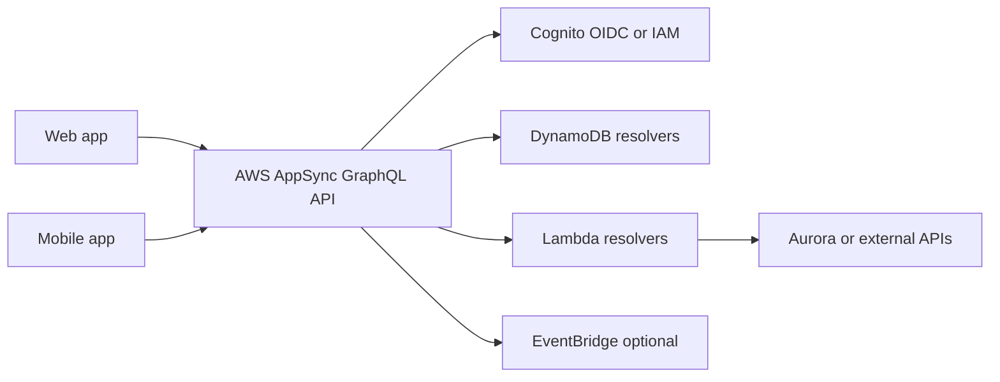

# GraphQL BFF with AppSync

## Use case

A web app and a mobile app need different screens over the same data: user, profile, orders, recommendations, inventory, and notifications.

## Main decision

Use **AppSync GraphQL** when the client needs to choose the data shape, combine multiple sources, and evolve screens without creating many REST endpoints.

Prefer **REST** when resources are simple, the contract is stable, or you want a lower learning curve. Prefer a **BFF on ECS/Lambda** if you need complex aggregation logic, specific libraries, or full runtime control.

## Key questions

- Do web and mobile clients need different data shapes?
- Do many screens over-fetch or under-fetch with REST?
- Do you want realtime subscriptions?
- Can you govern the GraphQL schema well?
- Can resolvers stay simple, or do you need a lot of logic?
- How will you solve field-level authorization?

## Why these services

- **AppSync**: managed GraphQL, integrated auth, resolvers, and subscriptions.
- **DynamoDB**: low latency for entities queried by key.
- **Lambda resolvers**: adapt complex logic or external integrations.
- **Cognito/OIDC/IAM**: auth depending on client type.
- **EventBridge**: decouples mutations from side effects.

## Pros

- Frontend gets exactly what it needs.
- Fewer screen-specific endpoints.
- Native subscriptions for changes.
- Good managed BFF pattern.
- Can integrate multiple sources.

## Cons

- Schema governance becomes critical.
- Risk of expensive queries or N+1.
- Observability must include resolvers, not only the API.
- Granular authorization can be complex.
- Caching requires careful design.

## Alerts and cost

Minimum:

- AppSync 4xx/5xx, latency, resolver errors.
- Lambda resolver Errors and p99 Duration.
- DynamoDB throttling and hot partitions.
- Budget for API and request spikes.

Cost drivers:

- GraphQL requests and subscriptions.
- Lambda resolvers.
- DynamoDB reads generated by nested queries.
- Detailed logs if always enabled.

## Natural evolution

- If queries are expensive: limit depth, complexity score, or persisted queries.
- If a view needs search/facets: add OpenSearch.
- If mutations have steps: move them to Step Functions.
- If the domain grows: split schema by bounded contexts.
- If only simple endpoints remain: consider REST to reduce complexity.

## Practice exercise

Model a GraphQL schema for `Customer`, `Order`, and `Product`. Decide which resolver goes directly to DynamoDB, which one uses Lambda, and which fields require authorization.

