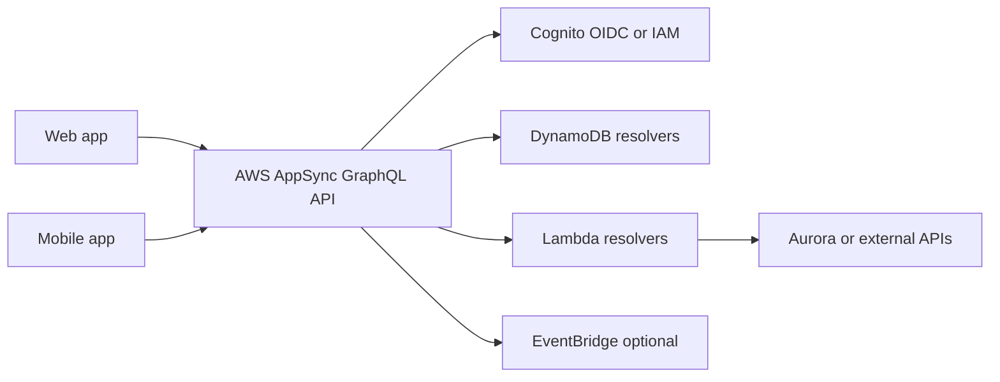
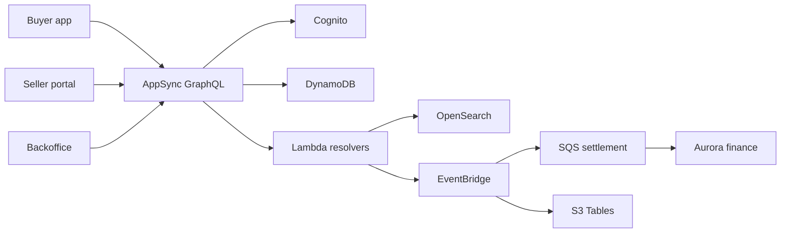

# GraphQL BFF con AppSync

## Caso de uso

Una aplicacion web y mobile necesitan pantallas diferentes sobre los mismos datos: usuario, perfil, ordenes, recomendaciones, inventario y notificaciones.

## Decision principal

Usa **AppSync GraphQL** cuando el cliente necesita elegir forma de datos, combinar varias fuentes y evolucionar pantallas sin crear muchos endpoints REST.

Prefiere **REST** cuando los recursos son simples, el contrato esta muy estable o quieres menor curva de aprendizaje. Prefiere un **BFF en ECS/Lambda** si necesitas logica de agregacion compleja, librerias especificas o control completo de runtime.

## Preguntas clave

- Los clientes web y mobile tienen necesidades de datos diferentes?
- Hay muchas pantallas que hacen over-fetching o under-fetching con REST?
- Quieres subscriptions en tiempo real?
- Puedes gobernar bien el schema GraphQL?
- Tus resolvers pueden ser simples o necesitas mucha logica?
- Como vas a resolver autorizacion campo por campo?

## Por que estos servicios

- **AppSync**: GraphQL administrado, auth integrada, resolvers y subscriptions.
- **DynamoDB**: baja latencia para entidades consultadas por clave.
- **Lambda resolvers**: adaptan logica compleja o integraciones externas.
- **Cognito/OIDC/IAM**: auth segun tipo de cliente.
- **EventBridge**: desacopla mutaciones de efectos secundarios.

## Pros

- Frontend obtiene exactamente lo que necesita.
- Menos endpoints especificos por pantalla.
- Subscriptions nativas para cambios.
- Buen patron BFF administrado.
- Puede integrar multiples fuentes.

## Contras

- Schema governance se vuelve critica.
- Riesgo de queries caras o N+1.
- Observabilidad debe incluir resolvers, no solo API.
- Autorizacion granular puede ser compleja.
- Caching requiere diseno cuidadoso.

## Alertas y costos

Minimo:

- AppSync 4xx/5xx, latency, resolver errors.
- Lambda resolver Errors y Duration p99.
- DynamoDB throttling y hot partitions.
- Budget por API y alertas de request spikes.

Cost drivers:

- Requests GraphQL y subscriptions.
- Resolvers Lambda.
- Lecturas DynamoDB generadas por queries anidadas.
- Logs detallados si se dejan siempre activos.

## Evolucion natural

- Si queries son caras: limitar profundidad, complexity score o persisted queries.
- Si una vista requiere busqueda/facetas: agregar OpenSearch.
- Si hay mutaciones con pasos: mover a Step Functions.
- Si el dominio crece: dividir schema por bounded contexts.
- Si solo quedan endpoints simples: considerar REST para reducir complejidad.

## Ejemplos aplicados

### Ejemplo 1: Marketplace con apps web, seller y mobile

**Contexto:** Un marketplace tiene tres clientes con pantallas distintas: comprador mobile, panel de vendedores y backoffice. Todos necesitan el mismo dominio, pero no los mismos campos.

**Preguntas y respuestas:**

- **Cada frontend necesita un contrato propio?** Si. GraphQL reduce endpoints duplicados y permite que cada cliente pida solo inventario, pedidos, pagos o reputacion segun la vista.
- **Que debe resolverse directo y que va por Lambda?** Lecturas simples salen con resolvers directos a DynamoDB; reglas de precios, permisos y agregaciones cruzadas usan Lambda.
- **Como evitar que GraphQL oculte costos?** Limitar profundidad, medir resolver latency, cachear lecturas repetidas y etiquetar costos por cliente.

**Diseno por etapa:**

- **Proyecto inicial:** AppSync, Cognito, DynamoDB para catalogo/pedidos, Lambda para resolvers complejos y CloudWatch para errores por resolver.
- **Etapa media:** OpenSearch para busqueda y facetas, EventBridge para eventos de orden, SQS para conciliacion y ElastiCache para sesiones o ranking temporal.
- **Gran escala:** Buses por dominio, Aurora para liquidaciones financieras, data lake en S3 Tables y cuentas separadas para compradores, vendedores y plataforma.

**Migracion/evolucion:** Si hoy hay muchos endpoints REST pegados al frontend, crear AppSync como BFF encima de APIs existentes, medir resolvers caros y migrar fuentes a DynamoDB/OpenSearch por dominio.

**Patrones relacionados:** [search-opensearch-cdc](../search-opensearch-cdc/index.md), [event-driven-domain-bus-eventbridge](../event-driven-domain-bus-eventbridge/index.md), [relational-sql-aurora-postgresql](../relational-sql-aurora-postgresql/index.md).

## Ejercicio de practica

Modela un schema GraphQL para `Customer`, `Order` y `Product`. Decide que resolver va directo a DynamoDB, cual usa Lambda y que campos requieren autorizacion.

