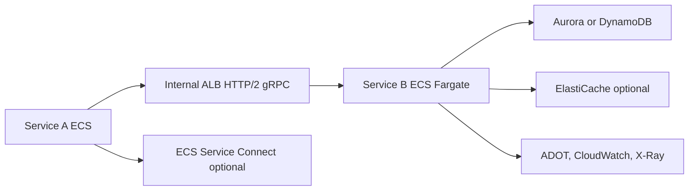

# Internal gRPC on ECS

## Use case

Low-latency internal microservices: pricing, inventory, payments, risk, or recommendations. Clients are other services, not browsers.

## Main decision

Use **gRPC on ECS/Fargate** when you need strongly typed contracts, low latency, internal streaming, or efficient service-to-service communication.

Use **REST** if the API is public or consumed by browsers without an extra gateway. Use **GraphQL** if the main problem is client aggregation. Use **EKS** only if you already need Kubernetes.

## Key questions

- Are consumers internal and controlled?
- Do you need versioned `.proto` contracts?
- Is there request/response or bidirectional streaming?
- Can the team operate containers?
- Do you need service discovery, mTLS, or traffic shifting?
- How will you propagate traces across services?

## Why these services

- **ECS Fargate**: containers without host management.
- **Internal ALB**: supports HTTP/2 and gRPC.
- **Service Connect**: discovery and service-to-service communication.
- **ADOT/X-Ray**: distributed traces.
- **Secrets Manager**: credentials outside images and plain variables.

## Pros

- Explicit contracts and generated clients.
- More efficient than JSON for intense internal traffic.
- Good fit for services with long-running runtimes.
- Blue/green or rolling deployments in ECS.
- Fine CPU/memory control.

## Cons

- Manual debugging is less simple than REST.
- Browser support requires a proxy or gateway.
- Requires disciplined protobuf versioning.
- Container operations are heavier than Lambda.
- Load balancing and health checks need solid testing.

## Alerts and cost

Minimum:

- ALB target 5xx, p99 target response time, unhealthy hosts.
- ECS CPU, memory, task restarts, deployment failures.
- Application gRPC status codes.
- Container Insights and logs with retention.
- Budget for Fargate vCPU/memory and ALB.

Cost drivers:

- Always-on Fargate tasks.
- ALB hours and LCU.
- NAT Gateway if private tasks access the internet.
- Verbose logs.

## Natural evolution

- If traffic grows: autoscale by CPU, memory, or custom metrics.
- If you need advanced resilience: circuit breakers and client retries.
- If service mesh matters: evaluate Service Connect or App Mesh more formally.
- If usage is only sporadic: reconsider Lambda.
- If many APIs are public: put REST/GraphQL at the edge and gRPC internally.

## Practice exercise

Define a `PricingService.GetQuote` service in protobuf. Design the task definition, internal ALB, health check, and metrics for errors by gRPC code.

