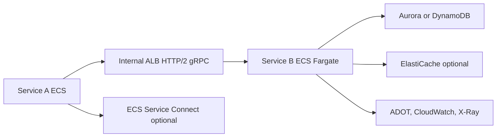

# gRPC Interno en ECS

## Caso de uso

Microservicios internos de baja latencia: pricing, inventario, pagos, riesgo o recomendaciones. Los clientes son otros servicios, no navegadores.

## Decision principal

Usa **gRPC sobre ECS/Fargate** cuando necesitas contratos fuertemente tipados, baja latencia, streaming interno o comunicacion servicio-a-servicio eficiente.

Usa **REST** si la API sera publica o consumida por navegadores sin gateway adicional. Usa **GraphQL** si el problema principal es agregacion para clientes. Usa **EKS** solo si ya necesitas Kubernetes.

## Preguntas clave

- Los consumidores son internos y controlados?
- Necesitas contratos `.proto` versionados?
- Hay streaming request/response o bidireccional?
- El equipo sabe operar contenedores?
- Necesitas service discovery, mTLS o traffic shifting?
- Como vas a propagar trazas entre servicios?

## Por que estos servicios

- **ECS Fargate**: contenedores sin administrar nodos.
- **Internal ALB**: soporta HTTP/2 y gRPC.
- **Service Connect**: discovery y comunicacion servicio-a-servicio.
- **ADOT/X-Ray**: trazas distribuidas.
- **Secrets Manager**: credenciales fuera de imagenes y variables planas.

## Pros

- Contratos explicitos y generacion de clientes.
- Mejor eficiencia que JSON para trafico interno intenso.
- Buen fit para servicios con runtime largo.
- Despliegue blue/green o rolling en ECS.
- Control fino de CPU/memoria.

## Contras

- Debugging manual menos simple que REST.
- Browser support requiere proxy o gateway.
- Requiere disciplina de versionado de protobuf.
- Operacion de contenedores es mas pesada que Lambda.
- Load balancing y health checks deben probarse bien.

## Alertas y costos

Minimo:

- ALB target 5xx, target response time p99, unhealthy hosts.
- ECS CPU, memory, task restarts, deployment failures.
- Application gRPC status codes.
- Container Insights y logs con retencion.
- Budget por Fargate vCPU/memoria y ALB.

Cost drivers:

- Tareas Fargate siempre encendidas.
- ALB hours y LCU.
- NAT Gateway si tareas privadas salen a internet.
- Logs verbosos.

## Evolucion natural

- Si el trafico crece: autoscaling por CPU, memoria o custom metrics.
- Si necesitas resiliencia avanzada: circuit breakers y retries en cliente.
- Si el mesh importa: evaluar App Mesh o Service Connect mas formal.
- Si solo hay picos esporadicos: reconsiderar Lambda.
- Si hay muchas APIs publicas: poner REST/GraphQL en el borde y gRPC interno.

## Ejercicio de practica

Define un servicio `PricingService.GetQuote` en protobuf. Disena task definition, ALB interno, health check y metricas de errores por codigo gRPC.

