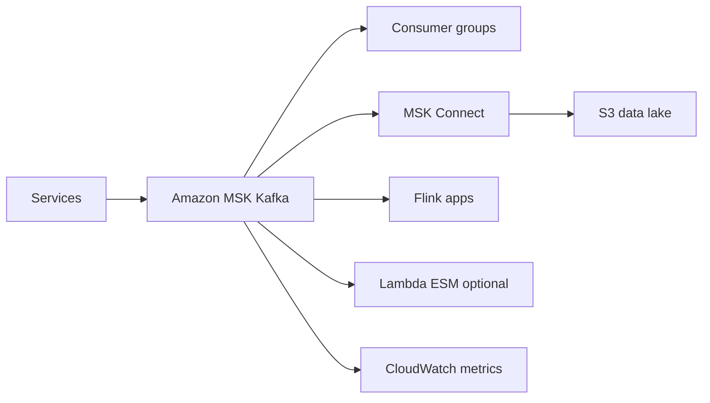
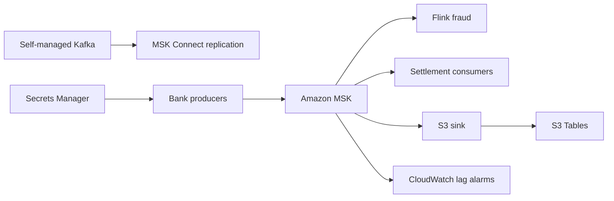

# Event Streaming with Amazon MSK

## Use case

Company with an existing Kafka ecosystem: microservices publish events, connectors integrate databases and data lake, consumers run analytics and near-realtime processing.

## Main decision

Use **Amazon MSK** when you need Kafka compatibility, partitions, offsets, replay, consumer groups, and connector ecosystem.

Use **Kinesis** if you want lower operational burden and do not need Kafka APIs. Use **EventBridge** for domain events with managed routing. Use **SQS** for task distribution.

## Key questions

- Do Kafka producers/consumers already exist?
- Do you need long retention and replay by offset?
- Can the team manage partitions and consumer lag?
- Do you need exactly-once or Kafka transactions?
- What serialization/schema approach will you use?
- How will you manage SASL/SCRAM or mTLS credentials?

## Why these services

- **MSK**: managed Kafka with API compatibility.
- **MSK Connect**: connectors to S3, JDBC, and other destinations.
- **Flink**: complex stream processing.
- **Secrets Manager**: secure Kafka credentials.
- **CloudWatch**: broker and consumer metrics.

## Pros

- Compatible with existing Kafka tools.
- Replay and multiple consumer groups.
- Broad connector ecosystem.
- Good fit for event sourcing and CDC.
- Granular partition control.

## Cons

- More complex than SQS/EventBridge.
- Poorly designed partitions create hot spots.
- Operation and versioning require Kafka knowledge.
- Broker costs run continuously.
- Client security must be handled carefully.

## Alerts and cost

Minimum:

- Consumer lag per group.
- Broker CPU, memory, disk, and network.
- Under-replicated partitions.
- Offline partitions.
- Produce/consume error rate.
- Budget for brokers, storage, data transfer, and connectors.

Guardrails:

- Credentials in Secrets Manager, not connection strings.
- Encryption in transit.
- Schema governance from day one.
- Do not use Kafka for simple tasks that SQS would solve.

## Natural evolution

- If operational load is heavy: evaluate Kinesis.
- If you only route events: EventBridge.
- If the stream feeds BI: sink to S3 Tables/Iceberg.
- If consumer lag grows: review partitions, batch size, and scaling.
- If contracts break: schema registry and backward compatibility.

## Applied Examples

### Example 1: Bank migrating core events from self-managed Kafka

**Context:** A bank already uses Kafka for transactions, fraud detection, and settlement. It wants less operations work without losing Kafka APIs or existing connectors.

**Questions and answers:**

- **Why MSK instead of Kinesis?** The existing ecosystem depends on Kafka API, consumer groups, schemas, and connectors; MSK lowers operations while preserving compatibility.
- **Express or Standard?** Express simplifies storage and throughput for new clusters; Standard applies when required configuration or controls are not available in Express.
- **Which metrics drive capacity?** Consumer lag, BytesInPerSec, Produce/Fetch throttle, CPU, under replicated partitions on Standard, and client configuration such as `linger.ms`.

**Architecture by stage:**

- **Initial project:** MSK in private subnets, IAM/SCRAM depending on clients, Secrets Manager for credentials, producers migrated by domain, and CloudWatch alarms.
- **Middle stage:** MSK Connect replicates from the old Kafka cluster, Flink processes fraud in real time, Schema Registry, and S3 sink for history.
- **Large-scale projection:** Multi-account producers/consumers, MirrorMaker/MSK Replicator across regions, tiered storage or lakehouse, and versioned event contracts.

**Migration/evolution:** Run temporary dual-write or replication, validate consumer lag and checksums, move consumer groups in waves, and cut producers last.

**Related patterns:** [streaming-kinesis-realtime-analytics](../streaming-kinesis-realtime-analytics/index.md), [batch-etl-glue-redshift](../batch-etl-glue-redshift/index.md), [multi-account-networking-vpc-endpoints](../multi-account-networking-vpc-endpoints/index.md).

## Practice exercise

Model topics for `orders`, `payments`, and `inventory`. Define partitioning, retention, consumer groups, and lag alarms.

