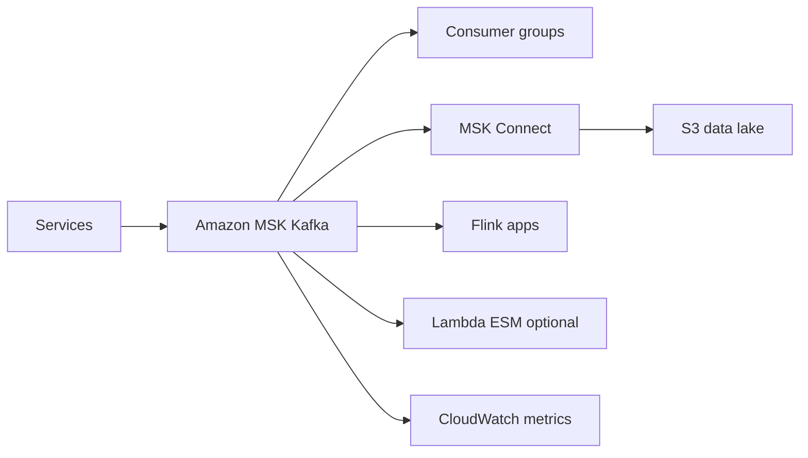
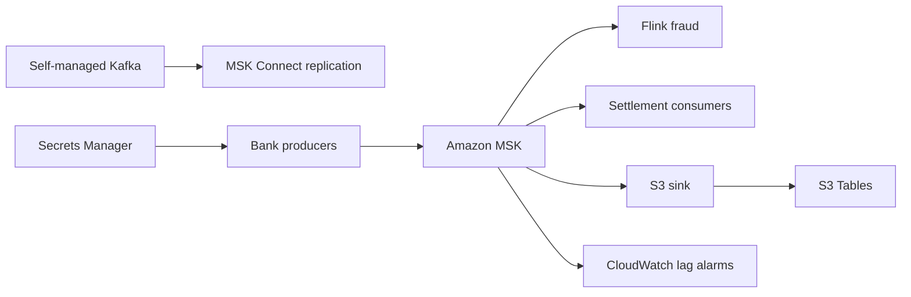

# Event Streaming con Amazon MSK

## Caso de uso

Empresa con ecosistema Kafka existente: microservicios publican eventos, conectores integran bases y data lake, consumidores hacen analitica y procesamiento near real-time.

## Decision principal

Usa **Amazon MSK** cuando necesitas compatibilidad Kafka, particiones, offsets, replay, consumer groups y ecosistema de conectores.

Usa **Kinesis** si quieres menor carga operacional y no necesitas API Kafka. Usa **EventBridge** para eventos de dominio con routing administrado. Usa **SQS** para distribucion de tareas.

## Preguntas clave

- Ya existen productores/consumidores Kafka?
- Necesitas retencion larga y replay por offset?
- El equipo sabe manejar particiones y consumer lag?
- Necesitas exactly-once o transacciones Kafka?
- Que esquema de serializacion usaras?
- Como manejaras credenciales SASL/SCRAM o mTLS?

## Por que estos servicios

- **MSK**: Kafka administrado con compatibilidad de API.
- **MSK Connect**: conectores hacia S3, JDBC y otros destinos.
- **Flink**: procesamiento complejo sobre streams.
- **Secrets Manager**: credenciales Kafka seguras.
- **CloudWatch**: broker y consumer metrics.

## Pros

- Compatible con herramientas Kafka existentes.
- Replay y multiples consumer groups.
- Amplio ecosistema de connectors.
- Buen fit para event sourcing y CDC.
- Control granular de particiones.

## Contras

- Mas complejo que SQS/EventBridge.
- Particiones mal disenadas generan hot spots.
- Operacion y versionado requieren conocimiento Kafka.
- Costos de brokers corren continuamente.
- Seguridad de clientes debe cuidarse mucho.

## Alertas y costos

Minimo:

- Consumer lag por grupo.
- Broker CPU, memoria, disco y network.
- Under replicated partitions.
- Offline partitions.
- Produce/consume error rate.
- Budget por brokers, storage, data transfer y connectors.

Guardrails:

- Credenciales en Secrets Manager, no en connection strings.
- Cifrado en transito.
- Schema governance desde el inicio.
- No usar Kafka para tareas simples que SQS resolveria.

## Evolucion natural

- Si la carga operacional pesa: evaluar Kinesis.
- Si solo haces routing de eventos: EventBridge.
- Si el stream alimenta BI: sink a S3 Tables/Iceberg.
- Si consumer lag crece: revisar particiones, batch size y escalado.
- Si hay contratos rotos: schema registry y compatibilidad hacia atras.

## Ejemplos aplicados

### Ejemplo 1: Banco que migra eventos core desde Kafka self-managed

**Contexto:** Un banco ya usa Kafka para transacciones, antifraude y conciliacion. Quiere reducir operacion sin perder APIs Kafka ni conectores existentes.

**Preguntas y respuestas:**

- **Por que MSK y no Kinesis?** El ecosistema existente depende de Kafka API, consumer groups, schemas y conectores; MSK reduce operacion manteniendo compatibilidad.
- **Express o Standard?** Express simplifica storage y throughput para nuevos clusters; Standard aplica si se requieren configuraciones o controles no disponibles en Express.
- **Que metricas deciden capacidad?** Consumer lag, BytesInPerSec, Produce/Fetch throttle, CPU, under replicated partitions en Standard y configuracion de clientes como `linger.ms`.

**Diseno por etapa:**

- **Proyecto inicial:** MSK en private subnets, IAM/SCRAM segun clientes, Secrets Manager para credenciales, productores migrados por dominio y CloudWatch alarms.
- **Etapa media:** MSK Connect replica desde Kafka anterior, Flink procesa fraude en tiempo real, Schema Registry y S3 sink para historicos.
- **Gran escala:** Multi-account producers/consumers, MirrorMaker/MSK Replicator entre regiones, tiered storage o lakehouse, y contratos de eventos versionados.

**Migracion/evolucion:** Ejecutar dual-write temporal o replicacion, validar consumer lag y checksums, mover consumer groups por oleadas y cortar productores al final.

**Patrones relacionados:** [streaming-kinesis-realtime-analytics](../streaming-kinesis-realtime-analytics/index.md), [batch-etl-glue-redshift](../batch-etl-glue-redshift/index.md), [multi-account-networking-vpc-endpoints](../multi-account-networking-vpc-endpoints/index.md).

## Ejercicio de practica

Modela topics para `orders`, `payments` y `inventory`. Define particionamiento, retencion, consumer groups y alarmas de lag.

