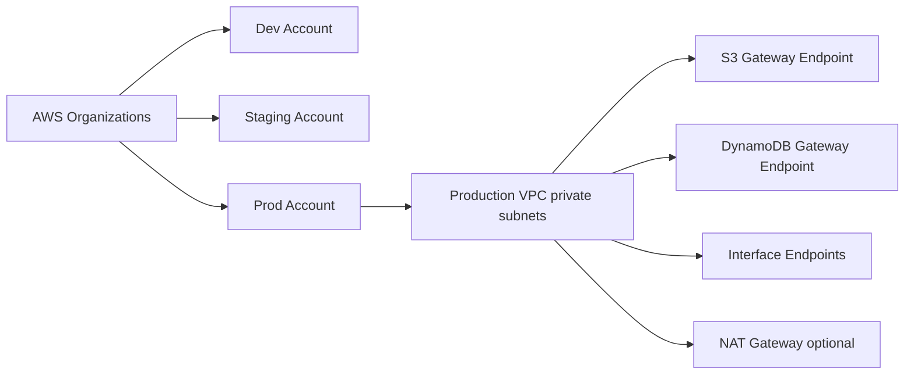
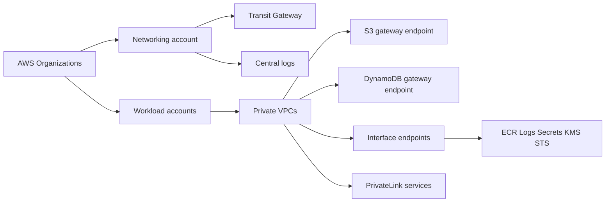

# Multi-Account Networking and VPC Endpoints

## Use case

Organization separates dev, staging, and prod. Private workloads need to access AWS services without exposing traffic or triggering unnecessary NAT costs.

## Main decision

Use **separate accounts + private VPC + endpoints** to isolate environments and control access/cost.

Use **NAT Gateway** when you need internet egress or services without endpoints. Use **PrivateLink/interface endpoints** for specific AWS or private services. Use **VPC peering/Transit Gateway** depending on number of VPCs and topology.

## Key questions

- Which environments should be isolated by account?
- Does the workload need internet or only AWS APIs?
- Which AWS services does it consume from private subnets?
- Does NAT cost per GB justify endpoints?
- Is there cross-account or on-prem connectivity?
- How do you audit flow logs and network changes?

## Why these services

- **Organizations/accounts**: smaller blast radius.
- **VPC private subnets**: network isolation.
- **Gateway endpoints**: S3/DynamoDB without hourly cost.
- **Interface endpoints**: private access to services through ENIs.
- **CloudTrail/VPC Flow Logs**: audit and diagnosis.

## Pros

- Strong isolation.
- Reduces public exposure.
- Can reduce NAT costs.
- Better environment-level control.
- Good foundation for compliance.

## Cons

- More routing complexity.
- Interface endpoints cost by AZ/hour/GB.
- Private DNS can be confusing.
- Cross-account requires governance.
- NAT is still needed for general internet.

## Alerts and cost

Minimum:

- NAT Gateway bytes processed.
- VPC endpoint errors if applicable.
- Flow Logs sampling for investigation.
- Route table changes via CloudTrail.
- Budget by account and networking.

Guardrails:

- Gateway endpoints for S3 and DynamoDB in private workloads.
- Endpoints for ECR, logs, Secrets Manager, SSM if ECS/Lambda in VPC need them.
- Security groups by flow, not unnecessary `0.0.0.0/0`.
- Separate prod in its own account.

## Natural evolution

- If there are many VPCs: Transit Gateway.
- If exposing an internal service to other accounts: PrivateLink.
- If users access globally: CloudFront at the edge.
- If NAT dominates cost: review endpoints and external traffic.
- If security grows: Network Firewall, Config, and SCPs.

## Applied Examples

### Example 1: Regulated company with private workloads and lower NAT spend

**Context:** A healthcare company separates accounts by environment and domain. Private workloads call S3, DynamoDB, ECR, Secrets Manager, and CloudWatch without needing general internet access.

**Questions and answers:**

- **What is centralized and what is not?** Shared networking, DNS, and common endpoints can be centralized; sensitive data and app roles stay in workload accounts.
- **Which endpoints reduce NAT?** Gateway endpoints for S3/DynamoDB; interface endpoints for ECR, logs, Secrets Manager, SSM, KMS, and STS.
- **How is cross-account access controlled?** Organizations, SCP, RAM, endpoint policies, security groups, and PrivateLink for internal services.

**Architecture by stage:**

- **Initial project:** Organizations with dev/staging/prod accounts, multi-AZ VPC, public/private subnets, NAT only where justified, and basic endpoints.
- **Middle stage:** Networking account, Transit Gateway or peering depending on topology, Route 53 Resolver, centralized logs, and endpoints by service.
- **Large-scale projection:** Landing zone, OUs by domain, PrivateLink for internal APIs, controlled egress, central inspection, and NAT cost monitoring by account.

**Migration/evolution:** If everything lives in one account, separate prod first, move logs/security to central accounts, then extract domains with a VPC endpoint strategy.

**Related patterns:** [security-iam-secrets-oidc](../security-iam-secrets-oidc/index.md), [container-web-app-fargate-alb](../container-web-app-fargate-alb/index.md), [cost-guardrails-budgets-anomaly](../cost-guardrails-budgets-anomaly/index.md).

## Practice exercise

Design a private VPC for ECS that needs ECR, S3, CloudWatch Logs, and Secrets Manager. Decide NAT vs endpoints and calculate the tradeoff.

