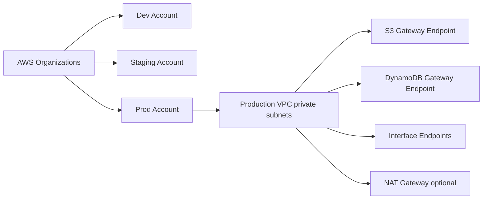

# Multi-Account Networking y VPC Endpoints

## Caso de uso

Organizacion separa dev, staging y prod. Workloads privados necesitan acceder a AWS services sin exponer trafico ni disparar costos innecesarios de NAT.

## Decision principal

Usa **cuentas separadas + VPC privada + endpoints** para aislar ambientes y controlar acceso/costo.

Usa **NAT Gateway** cuando necesitas salida a internet o servicios sin endpoint. Usa **PrivateLink/interface endpoints** para servicios AWS o privados especificos. Usa **VPC peering/Transit Gateway** segun numero de VPCs y topologia.

## Preguntas clave

- Que ambientes deben estar aislados por cuenta?
- El workload necesita internet o solo AWS APIs?
- Que servicios AWS consume desde subnets privadas?
- El costo NAT por GB justifica endpoints?
- Hay conectividad cross-account o on-prem?
- Como auditas flow logs y cambios de red?

## Por que estos servicios

- **Organizations/accounts**: blast radius menor.
- **VPC private subnets**: aislamiento de red.
- **Gateway endpoints**: S3/DynamoDB sin costo por hora.
- **Interface endpoints**: acceso privado a servicios via ENI.
- **CloudTrail/VPC Flow Logs**: auditoria y diagnostico.

## Pros

- Aislamiento fuerte.
- Reduce exposicion publica.
- Puede reducir costos NAT.
- Mejor control por ambiente.
- Buen fundamento para compliance.

## Contras

- Mas complejidad de routing.
- Interface endpoints tienen costo por AZ/hora/GB.
- DNS privado puede confundir.
- Cross-account requiere gobierno.
- NAT sigue siendo necesario para internet general.

## Alertas y costos

Minimo:

- NAT Gateway bytes procesados.
- VPC endpoint errors si aplica.
- Flow Logs sampling para investigacion.
- Route table changes via CloudTrail.
- Budget por cuenta y por networking.

Guardrails:

- Endpoints gateway para S3 y DynamoDB en workloads privados.
- Endpoints para ECR, logs, Secrets Manager, SSM si ECS/Lambda en VPC los necesita.
- Security groups por flujo, no `0.0.0.0/0` innecesario.
- Separar prod en cuenta propia.

## Evolucion natural

- Si hay muchas VPCs: Transit Gateway.
- Si expones servicio interno a otras cuentas: PrivateLink.
- Si usuarios acceden globalmente: CloudFront en el borde.
- Si NAT domina costo: revisar endpoints y trafico externo.
- Si seguridad crece: Network Firewall, Config y SCPs.

## Ejercicio de practica

Disena una VPC privada para ECS que necesita ECR, S3, CloudWatch Logs y Secrets Manager. Decide NAT vs endpoints y calcula tradeoff.

