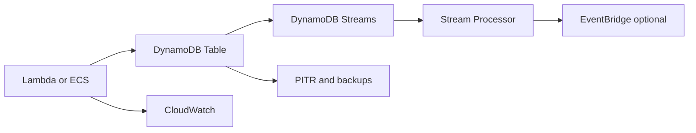

# NoSQL with DynamoDB Single Table

## Use case

Application with predictable access and high scale: profiles, orders by user, sessions, cart, workflow states, or file metadata.

## Main decision

Use **DynamoDB** when you can list key-based access patterns and need low latency with managed scale.

Use **Aurora PostgreSQL** if you need joins, ad hoc SQL, or complex relational transactions. Use **OpenSearch** for text search/facets. Use **S3 Tables/Athena** for historical analytics.

## Key questions

- Can you write the queries before designing the table?
- What are the PK/SK and GSIs?
- Are there hot partitions?
- Do you need ordering by entity?
- Can an item exceed 400 KB?
- Do you need TTL, Streams, or global tables?

## Why these services

- **DynamoDB**: key-value/document with low latency.
- **On-demand capacity**: good start with unknown traffic.
- **Provisioned + autoscaling**: better cost with stable traffic.
- **Streams**: CDC to Lambda/EventBridge.
- **PITR**: recovery from errors.

## Pros

- Excellent operational scale.
- Consistent latency.
- No server administration.
- Integrated TTL and streams.
- Good serverless fit.

## Cons

- Initial design matters a lot.
- Does not replace general SQL.
- GSIs add cost and eventual consistency.
- Hot keys can limit throughput.
- Changing access patterns can require remodeling.

## Alerts and cost

Minimum:

- ThrottledRequests.
- ConsumedReadCapacityUnits and ConsumedWriteCapacityUnits.
- SystemErrors.
- GSI throttling.
- UserErrors from conditional checks if applicable.
- Budget for table, backups, streams, and global tables.

Cost decisions:

- Start on-demand and move to provisioned when traffic is stable.
- Use TTL for temporary data.
- Avoid frequent scans.

## Natural evolution

- If flexible queries appear: duplicate into OpenSearch.
- If analytics appears: export to S3 Tables.
- If change events are needed: Streams + Lambda/EventBridge.
- If repeated reads cost too much: cache with ElastiCache or DAX.
- If active multi-region is needed: evaluate global tables.

## Practice exercise

Design a table for ecommerce: customer, order, order items, and shipment. List 8 access patterns before defining keys.

