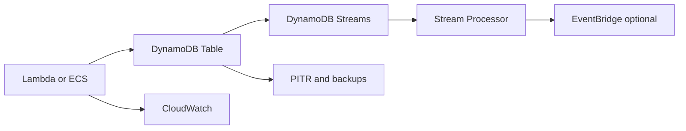

# NoSQL con DynamoDB Single Table

## Caso de uso

Aplicacion con accesos predecibles y alta escala: perfiles, ordenes por usuario, sesiones, carrito, estados de workflow o metadata de archivos.

## Decision principal

Usa **DynamoDB** cuando puedes listar patrones de acceso por clave y necesitas latencia baja con escala administrada.

Usa **Aurora PostgreSQL** si necesitas joins, SQL ad hoc o transacciones relacionales complejas. Usa **OpenSearch** para busqueda textual/facetas. Usa **S3 Tables/Athena** para analitica historica.

## Preguntas clave

- Puedes escribir las queries antes de disenar la tabla?
- Cuales son PK/SK y GSIs?
- Hay hot partitions?
- Necesitas orden por entidad?
- El item puede superar 400 KB?
- Necesitas TTL, Streams o global tables?

## Por que estos servicios

- **DynamoDB**: key-value/document con latencia baja.
- **On-demand capacity**: buen inicio con trafico desconocido.
- **Provisioned + autoscaling**: mejor costo con trafico estable.
- **Streams**: CDC hacia Lambda/EventBridge.
- **PITR**: recuperacion ante errores.

## Pros

- Escala operacional excelente.
- Latencia consistente.
- No administra servidores.
- TTL y streams integrados.
- Buen fit para serverless.

## Contras

- Diseno inicial importa mucho.
- No reemplaza SQL general.
- GSIs agregan costo y consistencia eventual.
- Hot keys pueden limitar throughput.
- Cambiar patrones de acceso puede requerir remodelar.

## Alertas y costos

Minimo:

- ThrottledRequests.
- ConsumedReadCapacityUnits y ConsumedWriteCapacityUnits.
- SystemErrors.
- GSI throttling.
- UserErrors por conditional checks si aplica.
- Budget por tabla, backups, streams y global tables.

Cost decisions:

- Empezar on-demand y migrar a provisioned cuando el patron sea estable.
- Usar TTL para datos temporales.
- Evitar scans frecuentes.

## Evolucion natural

- Si aparecen consultas flexibles: duplicar hacia OpenSearch.
- Si hay analitica: exportar a S3 Tables.
- Si hay eventos de cambio: Streams + Lambda/EventBridge.
- Si hay alto costo por lecturas repetidas: cache con ElastiCache o DAX.
- Si hay multi-region activo: evaluar global tables.

## Ejercicio de practica

Disena una tabla para ecommerce: customer, order, order items y shipment. Lista 8 patrones de acceso antes de definir claves.

