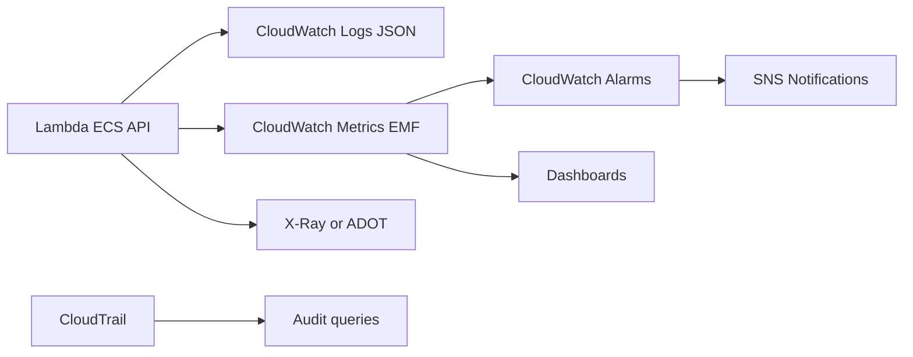
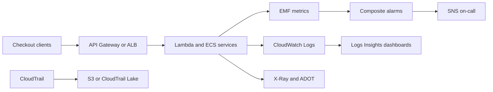

# Observability with CloudWatch, X-Ray, and ADOT

## Use case

Every production system needs to know whether it is healthy, where it fails, who changed something, and how long each operation takes.

## Main decision

Use **CloudWatch Logs, Metrics, Alarms, Dashboards, X-Ray/ADOT, and CloudTrail** as the operational baseline from the first deployment.

Do not leave it for later: without observability, you cannot make scaling, cost, reliability, or security decisions.

## Key questions

- How do you know the user is affected?
- What is the SLO metric: latency, errors, availability?
- Which logs allow debugging without exposing secrets?
- Where do you see traces across API, Lambda/ECS, DB, and queues?
- Which alarm wakes someone up, and which only goes to a dashboard?
- How do you answer "who deleted or changed this"?

## Why these services

- **CloudWatch Logs**: centralized logs.
- **EMF/Powertools**: custom metrics without synchronous calls.
- **CloudWatch Alarms**: detection and notification.
- **X-Ray/ADOT**: distributed traces.
- **CloudTrail**: auditing.
- **SNS**: alarm notification channel.

## Pros

- Native AWS baseline.
- Easy to connect alarms to SNS/Incident Manager.
- Traces help distributed systems.
- CloudTrail provides auditability.
- Dashboards speed up operations.

## Cons

- Logs without controlled retention cost money.
- Too many custom dimensions increase cost.
- High-resolution alarms cost more.
- Traces require instrumentation.
- Poorly tuned alerts create fatigue.

## Minimum recommended alarms

- Error rate, not only raw count.
- p99 latency, not Average.
- Throttles.
- Saturation: concurrency, CPU, memory, connections.
- Backlog: SQS age/depth, stream iterator age.
- DLQ depth > 0.
- Billing/Budgets per environment.

Alarm practices:

- Use M-of-N: for example 2 out of 3.
- Choose `treatMissingData` explicitly.
- `notBreaching` is common for error metrics.
- `breaching` for heartbeats.
- Composite alarms to reduce noise.

## Natural evolution

- If there are many accounts: cross-account observability.
- If traces leave AWS: ADOT/OpenTelemetry.
- If there are canaries: CloudWatch Synthetics.
- If incidents repeat: runbooks and service dashboards.
- If logs become expensive: retention, sampling, and log levels.

## Applied Examples

### Example 1: Observability for multi-service checkout

**Context:** A checkout flow uses API, payments, inventory, coupons, and notifications. The team sees errors but does not know where the user experience breaks.

**Questions and answers:**

- **Which SLI matters first?** Successful order rate, checkout p95/p99 latency, and errors by dependency.
- **What is instrumented?** Structured logging with correlation id, EMF metrics by domain, X-Ray/ADOT traces, and CloudTrail for infrastructure changes.
- **How is alarm noise reduced?** User-symptom alarms, composite alarms for dependencies, and service dashboards with runbooks.

**Architecture by stage:**

- **Initial project:** CloudWatch Logs with retention, API/Lambda/ECS metrics, basic alarms, and a checkout dashboard.
- **Middle stage:** ADOT collector, X-Ray traces, CloudWatch Logs Insights, custom business metrics, and SNS/PagerDuty for actionable alarms.
- **Large-scale projection:** Cross-account observability, SLOs by domain, canaries, CloudTrail Lake/Athena for audit, and OpenSearch for high-cardinality logs.

**Migration/evolution:** If only text logs exist today, move first to JSON with correlation id, then add EMF metrics, and finally distributed traces.

**Related patterns:** [container-web-app-fargate-alb](../container-web-app-fargate-alb/index.md), [rest-api-serverless-crud](../rest-api-serverless-crud/index.md), [cost-guardrails-budgets-anomaly](../cost-guardrails-budgets-anomaly/index.md).

## Practice exercise

Define a dashboard for an API with Lambda, SQS, and DynamoDB. Include 6 alarms, one composite alarm, and a retention policy.

