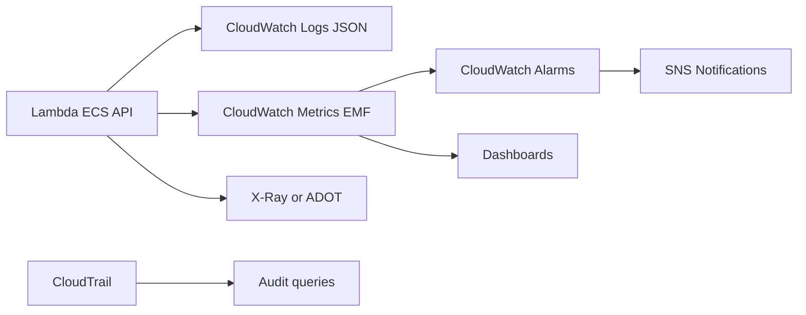

# Observabilidad con CloudWatch, X-Ray y ADOT

## Caso de uso

Cualquier sistema productivo necesita saber si esta sano, donde falla, quien cambio algo y cuanto tarda cada operacion.

## Decision principal

Usa **CloudWatch Logs, Metrics, Alarms, Dashboards, X-Ray/ADOT y CloudTrail** como base operacional desde el primer despliegue.

No lo dejes para despues: sin observabilidad, no puedes tomar decisiones de escalado, costo, confiabilidad ni seguridad.

## Preguntas clave

- Como sabes que el usuario esta afectado?
- Cual es la metrica SLO: latencia, errores, disponibilidad?
- Que logs permiten depurar sin exponer secretos?
- Donde ves trazas entre API, Lambda/ECS, DB y colas?
- Que alarma despierta a alguien y cual solo va a dashboard?
- Como respondes "quien borro o cambio esto"?

## Por que estos servicios

- **CloudWatch Logs**: logs centralizados.
- **EMF/Powertools**: metricas custom sin llamada sincrona.
- **CloudWatch Alarms**: deteccion y notificacion.
- **X-Ray/ADOT**: trazas distribuidas.
- **CloudTrail**: auditoria de API calls.
- **SNS**: canal de notificacion de alarmas.

## Pros

- Base nativa AWS.
- Facil conectar alarmas a SNS/Incident Manager.
- Trazas ayudan en sistemas distribuidos.
- CloudTrail da auditoria.
- Dashboards aceleran operacion.

## Contras

- Logs sin retencion controlada cuestan.
- Muchas dimensiones custom elevan costo.
- High-resolution alarms cuestan mas.
- Trazas requieren instrumentacion.
- Alertas mal calibradas generan fatiga.

## Alertas minimas recomendadas

- Error rate, no solo conteo bruto.
- Latencia p99, no Average.
- Throttles.
- Saturacion: concurrency, CPU, memory, connections.
- Backlog: SQS age/depth, stream iterator age.
- DLQ depth > 0.
- Billing/Budgets por ambiente.

Practicas de alarmas:

- Usar M-of-N: por ejemplo 2 de 3.
- Elegir `treatMissingData` explicitamente.
- `notBreaching` para metricas de errores es comun.
- `breaching` para heartbeats.
- Composite alarms para reducir ruido.

## Evolucion natural

- Si hay muchas cuentas: cross-account observability.
- Si hay trazas fuera de AWS: ADOT/OpenTelemetry.
- Si hay canarios: CloudWatch Synthetics.
- Si hay incidentes recurrentes: runbooks y dashboards por servicio.
- Si logs suben de costo: retencion, sampling y log levels.

## Ejercicio de practica

Define un dashboard para una API con Lambda, SQS y DynamoDB. Incluye 6 alarmas, un composite alarm y politica de retencion.

