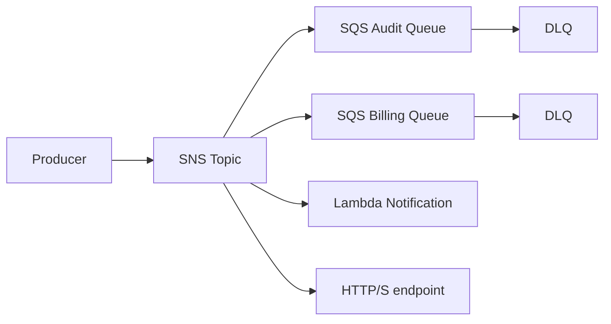

# Pub/Sub Notifications with SNS and SQS

## Use case

A simple event must reach several destinations: email, audit, billing, CRM, webhook, and internal processing.

## Main decision

Use **SNS + SQS** for simple fan-out where each consumer needs its own queue and independent retry.

Use **EventBridge** if you need content-based routing, SaaS integrations, schema registry, or domain buses. Use **direct SQS** if there is only one consumer. Use **Kinesis/MSK** if you need replay.

## Key questions

- Are there multiple independent consumers?
- Should each consumer fail without affecting the others?
- Can filtering be done with simple attributes?
- Do you need push to HTTP/email/SMS?
- Should the message be replayable later?
- How do you control permissions against confused deputy risks?

## Why these services

- **SNS**: publish to multiple subscribers.
- **SQS per consumer**: isolated buffer and retry.
- **DLQ per subscription/queue**: recoverable errors.
- **KMS**: encryption for topics and queues.

## Pros

- Simple and effective.
- Decoupled consumers.
- Supports varied protocols.
- SQS protects slow consumers.
- Less complex than Kafka for notifications.

## Cons

- Less expressive routing than EventBridge.
- No general replay after consumption.
- Requires correct queue policies to allow SNS.
- Ordering only with FIFO and its constraints.
- Can grow into topic sprawl without governance.

## Alerts and cost

Minimum:

- SNS NumberOfNotificationsFailed.
- SQS backlog and DLQ depth per consumer.
- Lambda subscriber Errors.
- Budget for requests and SMS/email if applicable.

Guardrails:

- Encrypt topic and queues with KMS if data is sensitive.
- Queue policy must allow `sns.amazonaws.com` with `aws:SourceArn`.
- Large messages: store payload in S3 and send a reference.

## Natural evolution

- If routing depends on complex content: EventBridge.
- If consumers need history: Kinesis/MSK.
- If one consumer becomes slow: adjust batch/concurrency.
- If external integrations are critical: use DLQ and controlled replay.
- If there are separate domains: topic per domain or bus per domain.

## Practice exercise

Design the `PaymentCaptured` event with three consumers: audit, email, and fulfillment. Define their DLQs and queue policies.

