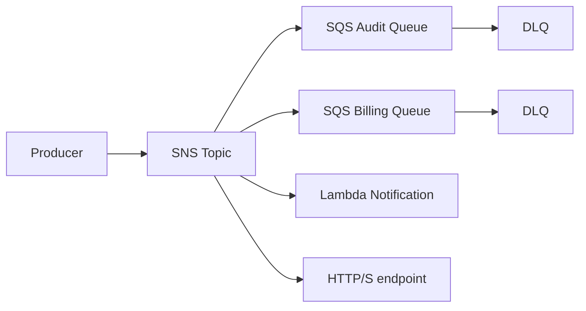
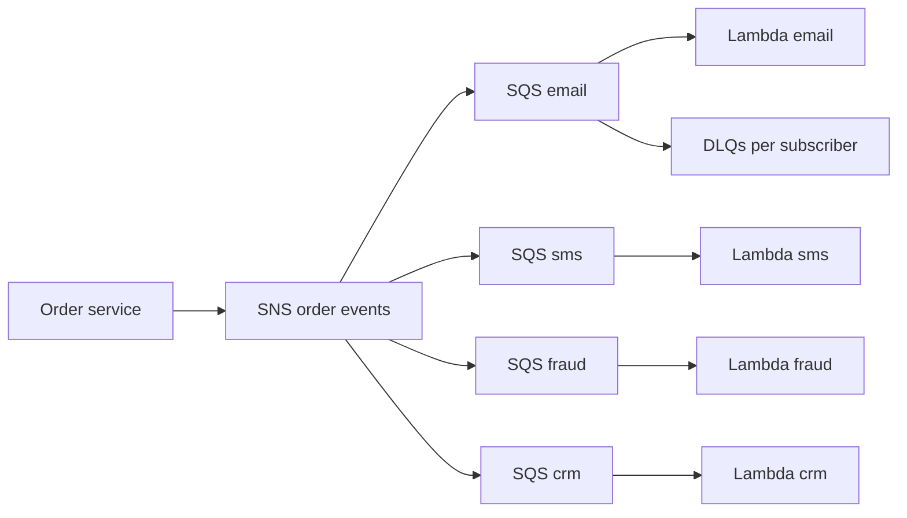

# Pub/Sub Notifications with SNS and SQS

## Use case

A simple event must reach several destinations: email, audit, billing, CRM, webhook, and internal processing.

## Main decision

Use **SNS + SQS** for simple fan-out where each consumer needs its own queue and independent retry.

Use **EventBridge** if you need content-based routing, SaaS integrations, schema registry, or domain buses. Use **direct SQS** if there is only one consumer. Use **Kinesis/MSK** if you need replay.

## Key questions

- Are there multiple independent consumers?
- Should each consumer fail without affecting the others?
- Can filtering be done with simple attributes?
- Do you need push to HTTP/email/SMS?
- Should the message be replayable later?
- How do you control permissions against confused deputy risks?

## Why these services

- **SNS**: publish to multiple subscribers.
- **SQS per consumer**: isolated buffer and retry.
- **DLQ per subscription/queue**: recoverable errors.
- **KMS**: encryption for topics and queues.

## Pros

- Simple and effective.
- Decoupled consumers.
- Supports varied protocols.
- SQS protects slow consumers.
- Less complex than Kafka for notifications.

## Cons

- Less expressive routing than EventBridge.
- No general replay after consumption.
- Requires correct queue policies to allow SNS.
- Ordering only with FIFO and its constraints.
- Can grow into topic sprawl without governance.

## Alerts and cost

Minimum:

- SNS NumberOfNotificationsFailed.
- SQS backlog and DLQ depth per consumer.
- Lambda subscriber Errors.
- Budget for requests and SMS/email if applicable.

Guardrails:

- Encrypt topic and queues with KMS if data is sensitive.
- Queue policy must allow `sns.amazonaws.com` with `aws:SourceArn`.
- Large messages: store payload in S3 and send a reference.

## Natural evolution

- If routing depends on complex content: EventBridge.
- If consumers need history: Kinesis/MSK.
- If one consumer becomes slow: adjust batch/concurrency.
- If external integrations are critical: use DLQ and controlled replay.
- If there are separate domains: topic per domain or bus per domain.

## Applied Examples

### Example 1: E-commerce sale notifications

**Context:** When an order is paid, several teams must act independently: email, SMS, inventory, fraud, and CRM.

**Questions and answers:**

- **Do we need long replay or just fan-out?** Only initial fan-out. SNS with filters and one SQS queue per consumer prevents an email failure from blocking inventory.
- **How do we avoid everybody receiving everything?** Filter policies by `event_type`, `country`, `amount`, or `channel` reduce noise and cost.
- **What about slow external providers?** Each subscriber has its own queue, DLQ, retry policy, and backlog alarms.

**Architecture by stage:**

- **Initial project:** The order service publishes to an SNS `order-events` topic; SQS queues exist for email/SMS/CRM; Lambda processes each queue.
- **Middle stage:** Topics by domain, KMS on SNS/SQS, DLQ per subscriber, and EventBridge when richer content-based routing is needed.
- **Large-scale projection:** Multi-account fan-out, audit files to S3, user channel preference in DynamoDB, and marketing segmentation in the data lake.

**Migration/evolution:** If one Lambda manually calls five APIs today, replace direct calls with one SNS publish and migrate one consumer at a time without changing the producer contract.

**Related patterns:** [event-driven-domain-bus-eventbridge](../event-driven-domain-bus-eventbridge/index.md), [async-worker-sqs-lambda](../async-worker-sqs-lambda/index.md), [observability-cloudwatch-xray-adot](../observability-cloudwatch-xray-adot/index.md).

## Practice exercise

Design the `PaymentCaptured` event with three consumers: audit, email, and fulfillment. Define their DLQs and queue policies.

