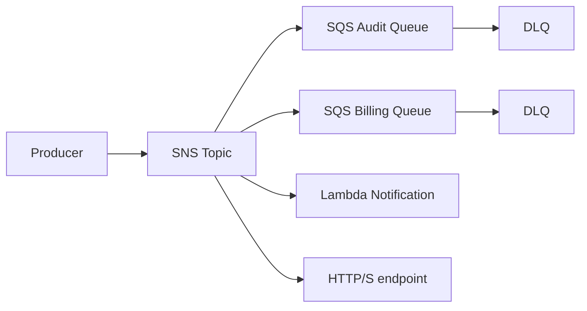
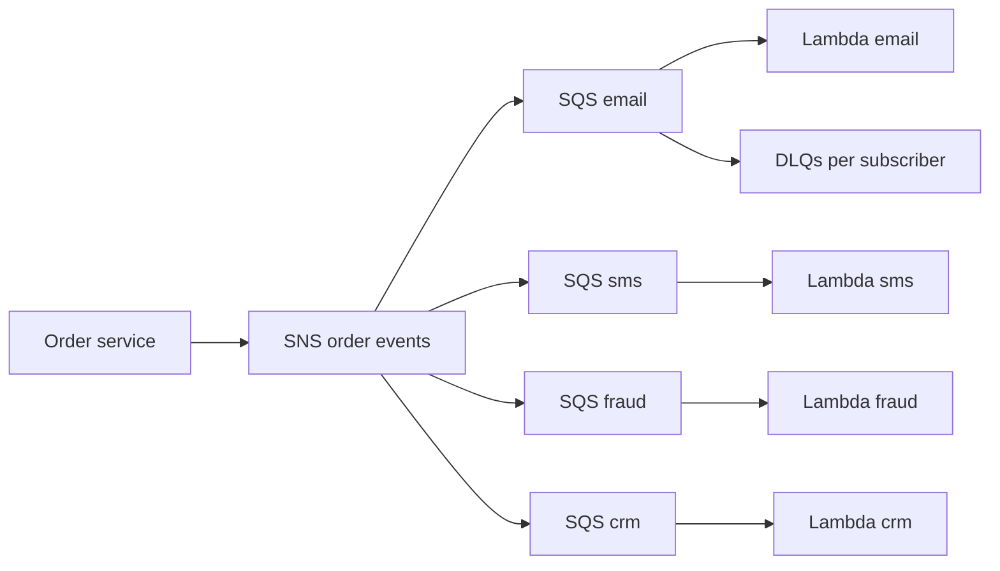

# Pub/Sub de Notificaciones con SNS y SQS

## Caso de uso

Un evento simple debe llegar a varios destinos: email, auditoria, facturacion, CRM, webhook y procesamiento interno.

## Decision principal

Usa **SNS + SQS** para fan-out simple donde cada consumidor necesita su propia cola y retry independiente.

Usa **EventBridge** si necesitas routing por contenido, SaaS integrations, schema registry o buses por dominio. Usa **SQS directo** si solo hay un consumidor. Usa **Kinesis/MSK** si necesitas replay.

## Preguntas clave

- Hay multiples consumidores independientes?
- Cada consumidor debe fallar sin afectar a los demas?
- El filtrado se puede hacer por atributos simples?
- Necesitas push a HTTP/email/SMS?
- El mensaje debe poder reproducirse despues?
- Como controlas permisos contra confused deputy?

## Por que estos servicios

- **SNS**: publicacion a multiples suscriptores.
- **SQS por consumidor**: buffer y retry aislado.
- **DLQ por suscripcion/cola**: errores recuperables.
- **KMS**: cifrado de topics y colas.

## Pros

- Simple y efectivo.
- Consumidores desacoplados.
- Permite protocolos variados.
- SQS protege consumidores lentos.
- Menor complejidad que Kafka para notificaciones.

## Contras

- Routing menos expresivo que EventBridge.
- No hay replay general despues de consumir.
- Requiere politicas correctas en colas para permitir SNS.
- Orden solo con FIFO y restricciones asociadas.
- Puede crecer como "topic sprawl" sin gobierno.

## Alertas y costos

Minimo:

- SNS NumberOfNotificationsFailed.
- SQS backlog y DLQ depth por consumidor.
- Lambda subscriber Errors.
- Budget por requests y SMS/email si aplica.

Guardrails:

- Cifrar topic y colas con KMS si hay datos sensibles.
- Queue policy debe permitir `sns.amazonaws.com` con `aws:SourceArn`.
- Mensajes grandes: guardar payload en S3 y mandar referencia.

## Evolucion natural

- Si el routing depende de contenido complejo: EventBridge.
- Si consumidores necesitan historico: Kinesis/MSK.
- Si un consumidor se vuelve lento: ajustar batch/concurrency.
- Si hay integraciones externas criticas: usar DLQ y replay controlado.
- Si hay dominios separados: topic por dominio o bus por dominio.

## Ejemplos aplicados

### Ejemplo 1: Notificaciones de venta para e-commerce

**Contexto:** Cuando una orden se paga, varios equipos deben actuar de forma independiente: email, SMS, inventario, antifraude y CRM.

**Preguntas y respuestas:**

- **Necesitamos replay largo o solo fan-out?** Solo fan-out inicial. SNS con filtros y SQS por consumidor evita que un fallo de email bloquee inventario.
- **Como se evita que todos reciban todo?** Filter policies por `event_type`, `country`, `amount` o `channel` reducen ruido y costo.
- **Que pasa con proveedores externos lentos?** Cada suscriptor tiene su cola, DLQ, retry propio y alarmas por backlog.

**Diseno por etapa:**

- **Proyecto inicial:** Servicio de orden publica en SNS `order-events`; SQS por email/SMS/CRM; Lambda procesa cada cola.
- **Etapa media:** Topics por dominio, KMS en SNS/SQS, DLQ por suscriptor, EventBridge si se necesita routing por contenido mas rico.
- **Gran escala:** Multi-account fan-out, archivos de auditoria a S3, preferencia de canal por usuario en DynamoDB y segmentacion de marketing en data lake.

**Migracion/evolucion:** Si un Lambda hoy llama manualmente a cinco APIs, reemplazar llamadas directas por un publish SNS y migrar consumidor por consumidor sin cambiar el contrato del productor.

**Patrones relacionados:** [event-driven-domain-bus-eventbridge](../event-driven-domain-bus-eventbridge/index.md), [async-worker-sqs-lambda](../async-worker-sqs-lambda/index.md), [observability-cloudwatch-xray-adot](../observability-cloudwatch-xray-adot/index.md).

## Ejercicio de practica

Disena el evento `PaymentCaptured` con tres consumidores: auditoria, email y fulfillment. Define sus DLQ y politicas de cola.

