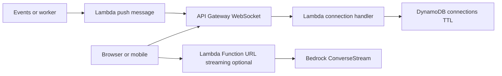

# Realtime WebSocket and LLM Streaming

## Use case

Chat, live notifications, live dashboards, or token-by-token LLM responses.

## Main decision

Use **API Gateway WebSocket + Lambda + DynamoDB TTL** for bidirectional communication and notifications. Use **Lambda Function URL streaming + Bedrock ConverseStream** for LLM token streaming.

Use **AppSync subscriptions** if your client already uses GraphQL. Use **SSE** if you only need simple server-to-client streaming. Use **ECS WebSocket** if you need connections with complex persistent logic.

## Key questions

- Do you need bidirectional communication or only push?
- How long does a connection last?
- How do you authenticate on `$connect`?
- How do you clean stale connections?
- What happens if the client disconnects?
- Do you need token streaming or discrete messages?

## Why these services

- **API Gateway WebSocket**: managed connections.
- **Lambda**: handlers for connect/disconnect/message.
- **DynamoDB TTL**: connectionId state.
- **Function URL streaming**: token streaming responses.
- **Bedrock ConverseStream**: incremental generation.

## Pros

- No WebSocket servers to manage.
- Scales by events.
- DynamoDB handles connection state.
- Good fit for chats and notifications.
- LLM streaming improves UX.

## Cons

- Timeout and message size limits.
- Connection state must be cleaned.
- WebSocket auth requires design.
- Lambda is not ideal for long persistent logic.
- Streaming can increase cost without limits.

## Alerts and cost

Minimum:

- Connect/disconnect/message errors.
- Lambda Errors/Duration/Throttles.
- DynamoDB throttling and TTL cleanup.
- Bedrock token usage and throttling.
- Budget for WebSocket messages, Lambda, and tokens.

Guardrails:

- TTL for connection records.
- Rate limit per user.
- Auth on `$connect`.
- Do not expose a production Function URL with auth `NONE`.
- Correlation ID per conversation.

## Natural evolution

- If there are only GraphQL notifications: AppSync subscriptions.
- If connections need in-memory state: ECS.
- If LLM cost rises: semantic cache and token limits.
- If multi-region: think about global state and routing.
- If there is backpressure: SQS between events and push.

## Practice exercise

Design a support chat with WebSocket and RAG streaming. Define auth, connections table, per-user limits, alarms, and token budget.

