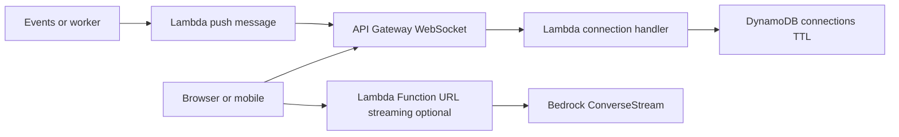
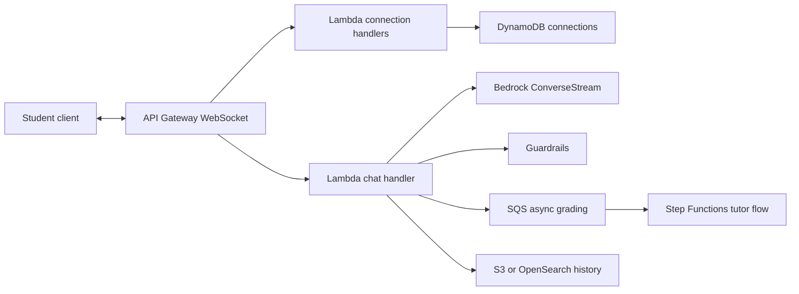

# Realtime WebSocket y LLM Streaming

## Caso de uso

Chat, notificaciones live, dashboards en vivo o respuestas LLM token-by-token.

## Decision principal

Usa **API Gateway WebSocket + Lambda + DynamoDB TTL** para comunicacion bidireccional y notificaciones. Usa **Lambda Function URL streaming + Bedrock ConverseStream** para streaming de tokens LLM.

Usa **AppSync subscriptions** si tu cliente ya usa GraphQL. Usa **SSE** si solo necesitas server-to-client simple. Usa **ECS WebSocket** si necesitas conexiones con logica persistente compleja.

## Preguntas clave

- Necesitas bidireccional o solo push?
- Cuanto dura una conexion?
- Como autenticas en `$connect`?
- Como limpias conexiones stale?
- Que pasa si el cliente se desconecta?
- Necesitas streaming de tokens o mensajes discretos?

## Por que estos servicios

- **API Gateway WebSocket**: conexiones administradas.
- **Lambda**: handlers por connect/disconnect/message.
- **DynamoDB TTL**: estado de connectionId.
- **Function URL streaming**: respuestas token streaming.
- **Bedrock ConverseStream**: generacion incremental.

## Pros

- Sin administrar servidores WebSocket.
- Escala por eventos.
- DynamoDB maneja estado de conexiones.
- Buen fit para chats y notificaciones.
- LLM streaming mejora UX.

## Contras

- Limites de timeout y tamano de mensaje.
- Estado de conexion debe mantenerse limpio.
- Auth en WebSocket requiere diseno.
- Lambda no es ideal para logica persistente larga.
- Streaming puede aumentar costo si no hay limites.

## Alertas y costos

Minimo:

- Connect/disconnect/message errors.
- Lambda Errors/Duration/Throttles.
- DynamoDB throttling y TTL cleanup.
- Bedrock token usage y throttling.
- Budget por mensajes WebSocket, Lambda y tokens.

Guardrails:

- TTL para connection records.
- Rate limit por usuario.
- Auth en `$connect`.
- No poner Function URL publica con auth `NONE` en produccion.
- Correlation ID por conversacion.

## Evolucion natural

- Si solo hay notificaciones GraphQL: AppSync subscriptions.
- Si conexiones requieren estado en memoria: ECS.
- Si LLM costo sube: semantic cache y limites de tokens.
- Si hay multi-region: pensar en estado global y routing.
- Si hay backpressure: SQS entre eventos y push.

## Ejemplos aplicados

### Ejemplo 1: Tutor IA con chat en vivo y streaming de tokens

**Contexto:** Una edtech quiere chat bidireccional, respuestas de LLM token a token, presencia en aula y notificaciones de ejercicios.

**Preguntas y respuestas:**

- **WebSocket o SSE?** WebSocket si hay presencia, mensajes cliente-servidor y notificaciones; Function URL streaming o SSE sirve para token streaming unidireccional.
- **Donde guardar conexiones?** DynamoDB con TTL por `connectionId`, usuario y aula; ElastiCache si hay throughput muy alto de presencia.
- **Como controlar costo y abuso de LLM?** Auth en `$connect`, quotas por usuario, maxTokens explicito, guardrails y budget/anomaly detection.

**Diseno por etapa:**

- **Proyecto inicial:** API Gateway WebSocket, Lambda connect/message/disconnect, DynamoDB connections, Bedrock streaming y CloudWatch metrics.
- **Etapa media:** Step Functions para flujos de tutor, SQS para evaluaciones asincronas, cache semantico y moderacion con Guardrails.
- **Gran escala:** Sharding por aula/tenant, multi-region para latencia, OpenSearch/S3 para historial, y separacion de cuentas para IA y plataforma.

**Migracion/evolucion:** Si el chat actual usa polling REST, introducir WebSocket solo para eventos live, conservar REST para historico y mover respuestas LLM a streaming despues.

**Patrones relacionados:** [ai-rag-bedrock-vectors](../ai-rag-bedrock-vectors/index.md), [workflow-orchestration-step-functions](../workflow-orchestration-step-functions/index.md), [cost-guardrails-budgets-anomaly](../cost-guardrails-budgets-anomaly/index.md).

## Ejercicio de practica

Disena chat de soporte con WebSocket y RAG streaming. Define auth, tabla de conexiones, limites por usuario, alarms y presupuesto de tokens.

