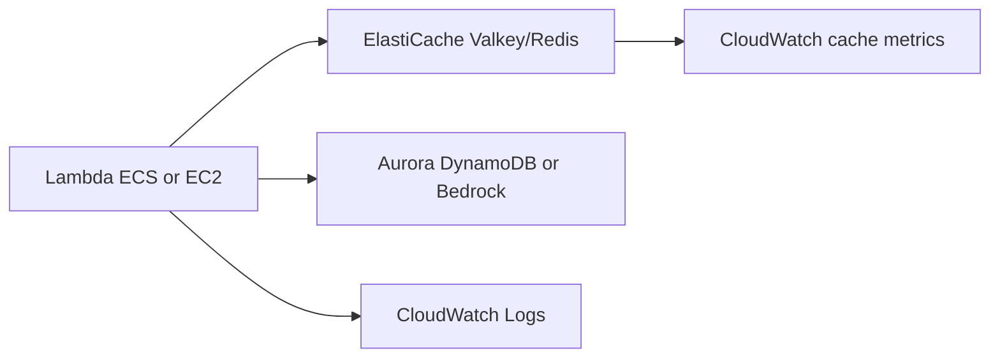

# Cache-Aside with ElastiCache Valkey/Redis

## Use case

An API repeatedly reads expensive data from Aurora, DynamoDB, or Bedrock. Latency rises and backend cost grows.

## Main decision

Use **ElastiCache Valkey/Redis** for cache-aside, sessions, rate limiting, counters, leaderboards, lightweight locks, or semantic cache.

Use **DynamoDB** if you need primary persistence. Use **CloudFront** for HTTP cache at the edge. Use **OpenSearch/S3 Vectors** for sustained vector search depending on QPS.

## Key questions

- Which read repeats, and how expensive is it?
- What TTL is acceptable per data type?
- How do you invalidate after a write?
- What happens if cache is unavailable?
- Do you need persistence, replicas, or global datastore?
- Serverless or node-based?

## Why these services

- **ElastiCache Serverless**: lower administration for general caching.
- **Node-based Valkey**: more control, global datastore, and vector search.
- **Valkey**: recommended option in skills for new caches.
- **CloudWatch**: hit rate, CPU, memory, and evictions.

## Pros

- Reduces latency.
- Reduces DB/LLM load and cost.
- Rich patterns: TTL, sorted sets, pub/sub, counters.
- Can implement rate limiting.
- Good complement to Aurora/DynamoDB.

## Cons

- Invalidation is hard.
- Cache stampede without protection.
- Stale data is possible.
- Access is VPC-centric.
- Serverless does not cover every advanced case.

## Alerts and cost

Minimum:

- Cache hit rate.
- CPU, memory usage, evictions.
- Connections.
- Replication lag if applicable.
- Latency and command errors.
- Budget for cache, data transfer, and nodes.

Guardrails:

- Do not create Redis clients at import time; initialize lazily.
- Use TLS/auth/IAM where applicable.
- Do not store secrets or PII unless needed.
- Test behavior when cache is down.

## Natural evolution

- If hit rate is low: review keys, TTL, and invalidation.
- If memory fills: compress, lower TTL, or scale.
- If one key is hot: logical sharding or local cache.
- If LLM cost is high: semantic cache.
- If you need vector search: node-based Valkey 8.2+ or OpenSearch.

## Practice exercise

Add cache-aside to `GET /products/{id}`. Define key, TTL, invalidation after product update, and a low-hit-rate alarm.

