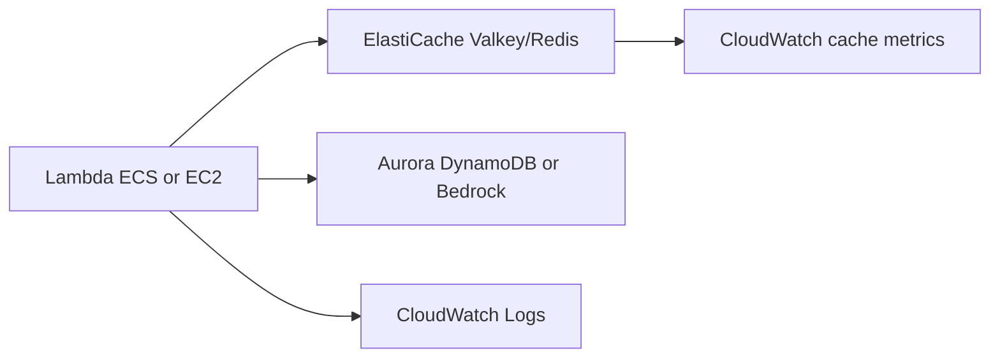
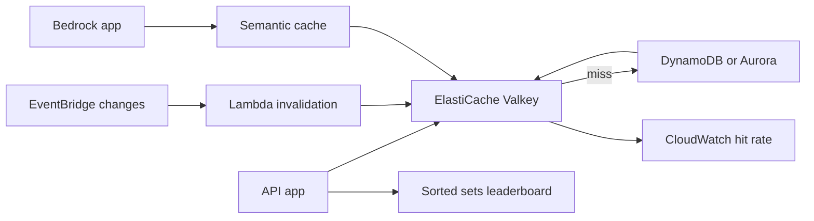

# Cache-Aside con ElastiCache Valkey/Redis

## Caso de uso

Una API lee repetidamente datos costosos desde Aurora, DynamoDB o Bedrock. La latencia sube y el costo de backend crece.

## Decision principal

Usa **ElastiCache Valkey/Redis** para cache-aside, sesiones, rate limiting, counters, leaderboards, locks livianos o cache semantico.

Usa **DynamoDB** si necesitas persistencia primaria. Usa **CloudFront** para cache HTTP en borde. Usa **OpenSearch/S3 Vectors** para busqueda vectorial sostenida segun QPS.

## Preguntas clave

- Que lectura se repite y cuanto cuesta?
- Que TTL es aceptable por tipo de dato?
- Como invalidas despues de una escritura?
- Que pasa si cache no esta disponible?
- Necesitas persistencia, replicas o global datastore?
- Serverless o node-based?

## Por que estos servicios

- **ElastiCache Serverless**: menor administracion para cache general.
- **Node-based Valkey**: mas control, global datastore y vector search.
- **Valkey**: opcion recomendada en skills para nuevos caches.
- **CloudWatch**: hit rate, CPU, memoria y evictions.

## Pros

- Reduce latencia.
- Reduce carga y costo de DB/LLM.
- Patrones ricos: TTL, sorted sets, pub/sub, counters.
- Puede implementar rate limiting.
- Buen complemento para Aurora/DynamoDB.

## Contras

- Invalidation es dificil.
- Cache stampede si no hay proteccion.
- Datos stale son posibles.
- Acceso es VPC-centric.
- Serverless no cubre todos los casos avanzados.

## Alertas y costos

Minimo:

- Cache hit rate.
- CPU, memory usage, evictions.
- Connections.
- Replication lag si aplica.
- Latency y command errors.
- Budget por cache, data transfer y nodos.

Guardrails:

- No crear clientes Redis en import time; inicializar lazy.
- Usar TLS/auth/IAM donde aplique.
- No guardar secretos ni PII sin necesidad.
- Probar comportamiento cuando cache cae.

## Evolucion natural

- Si hit rate es bajo: revisar keys, TTL e invalidacion.
- Si memoria se llena: comprimir, bajar TTL o escalar.
- Si una key es hot: sharding logico o cache local.
- Si LLM cuesta mucho: semantic cache.
- Si necesitas vector search: node-based Valkey 8.2+ o OpenSearch.

## Ejemplos aplicados

### Ejemplo 1: Leaderboard y cache de perfil para app fitness

**Contexto:** Una app fitness muestra rankings en vivo, perfiles de usuario y planes personalizados. La base principal no debe absorber todas las lecturas repetidas.

**Preguntas y respuestas:**

- **Que datos se cachean?** Perfil publico, ranking por reto y resultados de consultas caras. El dato canonico queda en DynamoDB o Aurora.
- **Que TTL usar?** Perfiles minutos, ranking segundos, feature flags mas largo; usar jitter para evitar cache stampede.
- **Serverless o node-based?** Serverless para cache-aside comun; node-based Valkey si se requiere vector search o control fino de topologia.

**Diseno por etapa:**

- **Proyecto inicial:** API en Lambda/ECS consulta ElastiCache con lazy connection, cae a DB en miss y escribe con TTL.
- **Etapa media:** Invalidacion por eventos, locks para recomputo, metricas de cache hit rate, CPU, memoria y conexiones.
- **Gran escala:** Sharding por tenant/reto, Global Datastore si aplica region secundaria, semantic cache para respuestas IA y backups/snapshots para datos derivados importantes.

**Migracion/evolucion:** Medir primero endpoints lentos, introducir cache-aside en una lectura de alto volumen, despues mover sesiones/rate limiting y finalmente patrones de leaderboard.

**Patrones relacionados:** [container-web-app-fargate-alb](../container-web-app-fargate-alb/index.md), [nosql-dynamodb-single-table](../nosql-dynamodb-single-table/index.md), [ai-rag-bedrock-vectors](../ai-rag-bedrock-vectors/index.md).

## Ejercicio de practica

Agrega cache-aside a `GET /products/{id}`. Define key, TTL, invalidacion al actualizar producto y alarma por hit rate bajo.

