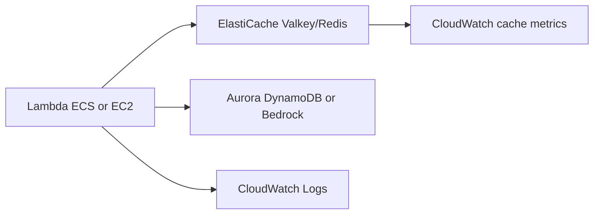

# Cache-Aside con ElastiCache Valkey/Redis

## Caso de uso

Una API lee repetidamente datos costosos desde Aurora, DynamoDB o Bedrock. La latencia sube y el costo de backend crece.

## Decision principal

Usa **ElastiCache Valkey/Redis** para cache-aside, sesiones, rate limiting, counters, leaderboards, locks livianos o cache semantico.

Usa **DynamoDB** si necesitas persistencia primaria. Usa **CloudFront** para cache HTTP en borde. Usa **OpenSearch/S3 Vectors** para busqueda vectorial sostenida segun QPS.

## Preguntas clave

- Que lectura se repite y cuanto cuesta?
- Que TTL es aceptable por tipo de dato?
- Como invalidas despues de una escritura?
- Que pasa si cache no esta disponible?
- Necesitas persistencia, replicas o global datastore?
- Serverless o node-based?

## Por que estos servicios

- **ElastiCache Serverless**: menor administracion para cache general.
- **Node-based Valkey**: mas control, global datastore y vector search.
- **Valkey**: opcion recomendada en skills para nuevos caches.
- **CloudWatch**: hit rate, CPU, memoria y evictions.

## Pros

- Reduce latencia.
- Reduce carga y costo de DB/LLM.
- Patrones ricos: TTL, sorted sets, pub/sub, counters.
- Puede implementar rate limiting.
- Buen complemento para Aurora/DynamoDB.

## Contras

- Invalidation es dificil.
- Cache stampede si no hay proteccion.
- Datos stale son posibles.
- Acceso es VPC-centric.
- Serverless no cubre todos los casos avanzados.

## Alertas y costos

Minimo:

- Cache hit rate.
- CPU, memory usage, evictions.
- Connections.
- Replication lag si aplica.
- Latency y command errors.
- Budget por cache, data transfer y nodos.

Guardrails:

- No crear clientes Redis en import time; inicializar lazy.
- Usar TLS/auth/IAM donde aplique.
- No guardar secretos ni PII sin necesidad.
- Probar comportamiento cuando cache cae.

## Evolucion natural

- Si hit rate es bajo: revisar keys, TTL e invalidacion.
- Si memoria se llena: comprimir, bajar TTL o escalar.
- Si una key es hot: sharding logico o cache local.
- Si LLM cuesta mucho: semantic cache.
- Si necesitas vector search: node-based Valkey 8.2+ o OpenSearch.

## Ejercicio de practica

Agrega cache-aside a `GET /products/{id}`. Define key, TTL, invalidacion al actualizar producto y alarma por hit rate bajo.

