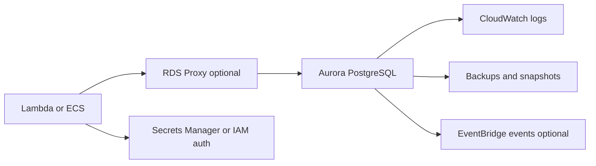
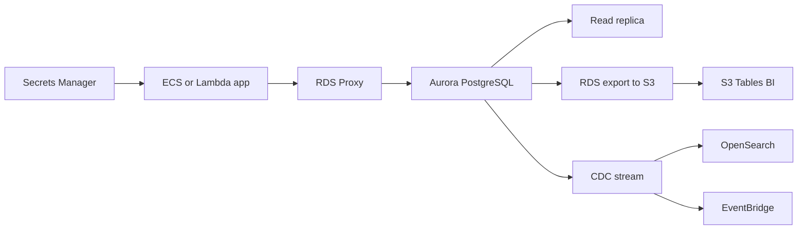

# Relational SQL with Aurora PostgreSQL

## Use case

Reservation, payment, billing, or CRM system with transactions, constraints, joins, operational reports, and strong consistency.

## Main decision

Use **Aurora PostgreSQL** when the relational model and transactions are central to the domain.

Use **DynamoDB** if your access is key-based, without joins, and at very high scale. Use **Redshift/S3 Tables** for historical analytics, not OLTP transactions. Use **DocumentDB** if a document model is natural and MongoDB compatibility matters.

## Key questions

- Do you need multi-entity transactions?
- Does the domain depend on constraints and joins?
- Do you have operational ad hoc queries?
- Is traffic stable or variable?
- Do you need scale-to-zero or serverless capacity?
- How will you manage connections from Lambda?

## Why these services

- **Aurora PostgreSQL**: PostgreSQL-compatible, managed HA.
- **Aurora Serverless v2**: elastic capacity for variable traffic.
- **RDS Proxy**: pooling for Lambda/ECS with many connections.
- **Secrets Manager/IAM auth**: secure credential handling.
- **CloudWatch logs/Performance Insights**: diagnostics.

## Pros

- Familiar relational model.
- Robust transactions.
- Strong PostgreSQL ecosystem.
- Managed backups and replicas.
- Can use pgvector when applicable.

## Cons

- Horizontal write scaling is not trivial.
- Poor connection handling exhausts the database.
- Provisioned costs run even without traffic.
- Schema migrations require discipline.
- Analytical queries can affect OLTP.

## Alerts and cost

Minimum:

- CPUUtilization, DatabaseConnections, FreeableMemory.
- Deadlocks, replica lag, storage usage.
- Slow query logs.
- ACU usage if serverless.
- Budget for instances/ACU, storage, I/O, and backups.

Cost decisions:

- Evaluate I/O-Optimized if I/O is a large share of cost.
- Evaluate RI or Database Savings Plans only with real data.
- Move heavy analytics to data lake/Redshift.

## Natural evolution

- If there are many Lambda connections: RDS Proxy.
- If reads dominate: read replicas or cache.
- If ad hoc queries grow: ETL to S3 Tables/Athena.
- If multi-region is needed: evaluate global database and failover strategy.
- If some entities are key-value: move only those to DynamoDB.

## Applied Examples

### Example 1: Lending fintech with transactional rules

**Context:** A lending fintech must approve loans, record installments, reconcile payments, and serve operational reports with strong consistency and SQL queries.

**Questions and answers:**

- **Why not DynamoDB first?** There are joins, constraints, transactions, and operational reports; Aurora PostgreSQL reduces early modeling risk.
- **How is Aurora protected from serverless spikes?** RDS Proxy, Lambda concurrency limits, pooling in ECS, and read-only queries routed to replicas.
- **When should Aurora Serverless v2 be chosen?** When load is variable and ACU scaling is useful; provisioned capacity fits stable load and commitments.

**Architecture by stage:**

- **Initial project:** Aurora PostgreSQL Multi-AZ, app on ECS or Lambda with RDS Proxy, Secrets Manager, KMS, and versioned migrations.
- **Middle stage:** Read replicas, settlement jobs in Step Functions, export to S3 for BI, and alarms on connections, CPU, storage, and I/O.
- **Large-scale projection:** Separate OLTP from OLAP, partition large tables, use CDC to OpenSearch/EventBridge, and evaluate Global Database when multi-region reads justify it.

**Migration/evolution:** If migrating from PostgreSQL on a VM, use DMS or logical replication, validate critical queries, cut writes in a controlled window, and keep historical export to S3.

**Related patterns:** [search-opensearch-cdc](../search-opensearch-cdc/index.md), [batch-etl-glue-redshift](../batch-etl-glue-redshift/index.md), [container-web-app-fargate-alb](../container-web-app-fargate-alb/index.md).

## Practice exercise

Design a reservation database with transactions. Decide indexes, RDS Proxy, secrets, backups, alarms, and which data you would export to the lake.

