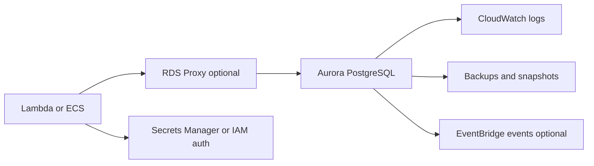
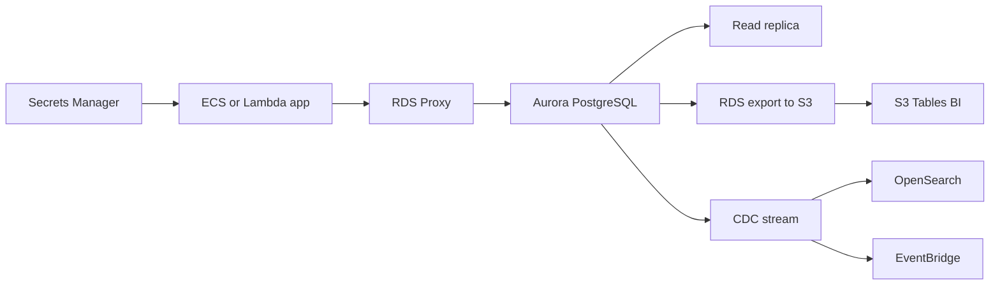

# Relacional SQL con Aurora PostgreSQL

## Caso de uso

Sistema de reservas, pagos, facturacion o CRM con transacciones, constraints, joins, reportes operacionales y consistencia fuerte.

## Decision principal

Usa **Aurora PostgreSQL** cuando el modelo relacional y las transacciones son el centro del dominio.

Usa **DynamoDB** si tus accesos son por clave, sin joins y a escala muy alta. Usa **Redshift/S3 Tables** para analitica historica, no para transacciones OLTP. Usa **DocumentDB** si el modelo documento es natural y necesitas compatibilidad MongoDB.

## Preguntas clave

- Necesitas transacciones multi-entidad?
- El dominio depende de constraints y joins?
- Tienes queries ad hoc operacionales?
- El trafico es estable o variable?
- Necesitas escala a cero o capacidad serverless?
- Como manejaras conexiones desde Lambda?

## Por que estos servicios

- **Aurora PostgreSQL**: PostgreSQL compatible, HA administrada.
- **Aurora Serverless v2**: capacidad elastica para trafico variable.
- **RDS Proxy**: pooling para Lambda/ECS con muchas conexiones.
- **Secrets Manager/IAM auth**: manejo seguro de credenciales.
- **CloudWatch logs/Performance Insights**: diagnostico.

## Pros

- Modelo relacional familiar.
- Transacciones robustas.
- Buen ecosistema PostgreSQL.
- Backups y replicas administradas.
- Puede usar pgvector si aplica.

## Contras

- Escalado horizontal de writes no es trivial.
- Conexiones mal manejadas agotan la base.
- Costos corren aunque no haya trafico en provisionado.
- Migraciones de schema requieren disciplina.
- Queries analiticas pueden afectar OLTP.

## Alertas y costos

Minimo:

- CPUUtilization, DatabaseConnections, FreeableMemory.
- Deadlocks, replica lag, storage usage.
- Slow query logs.
- ACU usage si es serverless.
- Budget por instancias/ACU, storage, I/O y backups.

Cost decisions:

- Evaluar I/O-Optimized si I/O es gran parte del costo.
- Evaluar RI o Database Savings Plans solo con datos reales.
- Separar analitica pesada a data lake/Redshift.

## Evolucion natural

- Si hay muchas conexiones Lambda: RDS Proxy.
- Si lecturas dominan: read replicas o cache.
- Si queries ad hoc crecen: ETL a S3 Tables/Athena.
- Si necesita multi-region: evaluar global database y estrategia de failover.
- Si algunas entidades son key-value: mover solo esas a DynamoDB.

## Ejemplos aplicados

### Ejemplo 1: Fintech de prestamos con reglas transaccionales

**Contexto:** Una fintech debe aprobar prestamos, registrar cuotas, conciliaciones y reportes operativos con consistencia fuerte y consultas SQL.

**Preguntas y respuestas:**

- **Por que no DynamoDB primero?** Hay joins, constraints, transacciones y reportes operacionales; Aurora PostgreSQL reduce riesgo de modelado temprano.
- **Como se protege Aurora de picos serverless?** RDS Proxy, limites de concurrencia en Lambda, pooling en ECS y consultas read-only hacia replicas.
- **Cuando elegir Aurora Serverless v2?** Cuando la carga es variable y se quiere escalar ACUs sin administrar instancias fijas; provisionado aplica para carga estable y compromisos.

**Diseno por etapa:**

- **Proyecto inicial:** Aurora PostgreSQL Multi-AZ, app en ECS o Lambda con RDS Proxy, Secrets Manager, KMS y migraciones versionadas.
- **Etapa media:** Read replicas, jobs de conciliacion en Step Functions, export a S3 para BI y alarmas por conexiones, CPU, storage e I/O.
- **Gran escala:** Separar OLTP de OLAP, particionar tablas grandes, usar CDC hacia OpenSearch/EventBridge y evaluar Global Database si la lectura multi-region lo justifica.

**Migracion/evolucion:** Si viene de PostgreSQL en VM, usar DMS o replica logica, validar queries criticas, cortar escrituras en ventana controlada y dejar export historico a S3.

**Patrones relacionados:** [search-opensearch-cdc](../search-opensearch-cdc/index.md), [batch-etl-glue-redshift](../batch-etl-glue-redshift/index.md), [container-web-app-fargate-alb](../container-web-app-fargate-alb/index.md).

## Ejercicio de practica

Disena base para reservas con transacciones. Decide indices, RDS Proxy, secretos, backups, alarmas y que datos exportarias al lake.

