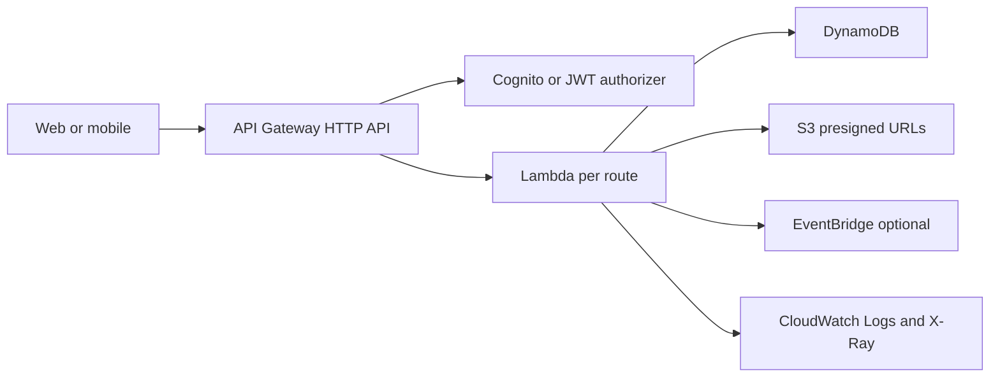
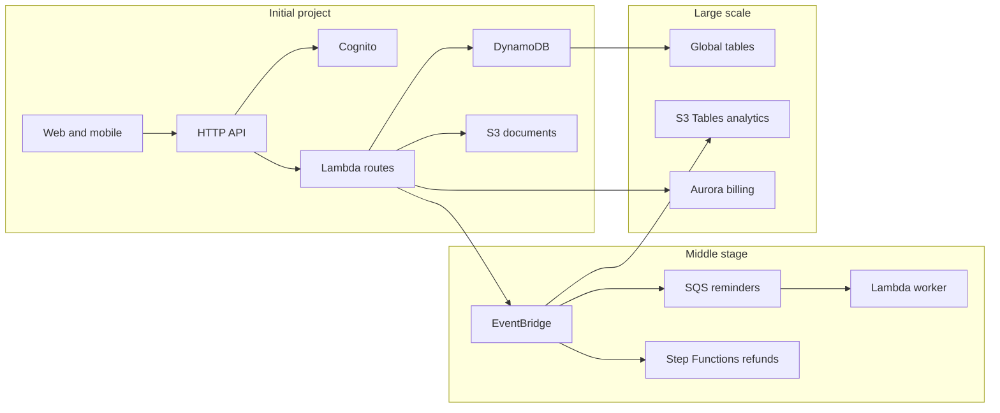

# Serverless REST API CRUD

## Use case

Backend for a web or mobile application: users create orders, browse a catalog, upload images, and receive synchronous responses.

## Main decision

Start with **API Gateway HTTP API + Lambda + DynamoDB** when the domain is CRUD, traffic is variable, and you want low operational overhead.

Use **API Gateway REST API** if you need direct WAF, API keys, usage plans, request validation, or native caching. Use **ECS/Fargate** if you need long connections, processes longer than 15 minutes, heavy dependencies, or runtime control.

## Key questions

- Does the response need to be immediate, or can it be asynchronous?
- Are the access patterns key-based and known?
- Are there joins, complex reports, or multi-table transactions?
- Does the payload exceed 10 MB?
- Do you need WAF, API keys, advanced throttling, or caching?
- Does the team prefer one function per route or a lambdalith such as Express/FastAPI?

## Why these services

- **HTTP API**: lower complexity for modern APIs.
- **Lambda**: scales on demand and reduces administration.
- **DynamoDB on-demand**: good starting point when traffic is unclear.
- **S3 presigned URLs**: avoids sending large files through API Gateway.
- **EventBridge**: publishes domain events without coupling consumers.

## Pros

- Fast time-to-market.
- Low cost with irregular traffic.
- Scales without server management.
- Granular IAM per function if you use micro-Lambda.
- Easy to add SQS, EventBridge, or Step Functions later.

## Cons

- Possible cold starts.
- 15-minute Lambda limit.
- Distributed debugging requires good observability.
- DynamoDB requires access-pattern design.
- APIs tightly coupled to the frontend can become messy.

## Alerts and cost

Minimum:

- API Gateway 4xx, 5xx, and p99 latency.
- Lambda Errors, Throttles, p99 Duration, ConcurrentExecutions.
- DynamoDB ThrottledRequests, ConsumedRead/WriteCapacity, SystemErrors.
- DLQ depth if there are async invocations.
- Monthly budget per environment and Cost Anomaly Detection.

Cost drivers:

- API Gateway requests.
- Lambda duration and memory.
- DynamoDB RCU/WCU or on-demand requests.
- CloudWatch Logs without retention.

## Natural evolution

- If an operation takes too long: move it to SQS + worker or Step Functions.
- If several consumers react to an order: publish an event to EventBridge.
- If there are repeated reads: add ElastiCache or DAX depending on the case.
- If relational queries appear: move that part to Aurora, not necessarily the whole system.
- If the frontend needs many aggregations: evaluate AppSync GraphQL.

## Applied Examples

### Example 1: Clinic bookings and payments

**Context:** A small clinic needs online scheduling, copay collection, document upload, and status lookup from web and mobile without operating servers.

**Questions and answers:**

- **Does booking need an immediate response?** Yes. Create appointment, check availability, and return confirmation stay synchronous; reminders, billing, and analytics can leave through EventBridge.
- **Does the data model need complex joins on day one?** No. DynamoDB handles patients, appointments, and states with `PK/SK`; S3 stores documents through Presigned URL so files do not cross API Gateway.
- **What signal forces evolution?** High p99 latency, relational billing queries, or many post-booking tasks.

**Architecture by stage:**

- **Initial project:** CloudFront for the frontend, API Gateway HTTP API, Cognito, per-route Lambda, DynamoDB on-demand, private S3 with KMS, and CloudWatch Logs with retention.
- **Middle stage:** EventBridge publishes `AppointmentBooked`, SQS decouples reminders and payments, Step Functions handles refunds, and X-Ray traces external calls.
- **Large-scale projection:** Separate accounts by environment, DynamoDB global tables for multi-region branches, Aurora for relational billing, and S3 Tables for historical reporting.

**Migration/evolution:** If an Express monolith already exists, start as a lambdalith or ECS/Fargate, extract hot routes into micro-Lambda functions, and move processes longer than 30 seconds to workers.

**Related patterns:** [async-worker-sqs-lambda](../async-worker-sqs-lambda/index.md), [event-driven-domain-bus-eventbridge](../event-driven-domain-bus-eventbridge/index.md), [relational-sql-aurora-postgresql](../relational-sql-aurora-postgresql/index.md).

## Practice exercise

Design an orders API with endpoints `POST /orders`, `GET /orders/{id}`, and `GET /customers/{id}/orders`. Define the DynamoDB table, alarms, budget, and an `OrderCreated` event.

