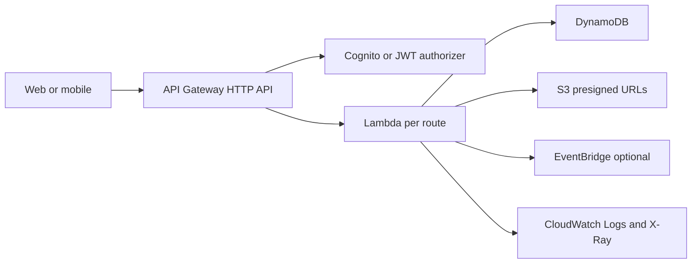

# REST API Serverless CRUD

## Caso de uso

Backend para una aplicacion web o mobile: usuarios crean pedidos, consultan catalogo, suben imagenes y reciben respuestas sincronas.

## Decision principal

Empieza con **API Gateway HTTP API + Lambda + DynamoDB** cuando el dominio es CRUD, el trafico es variable y quieres bajo mantenimiento operacional.

Usa **API Gateway REST API** si necesitas WAF directo, API keys, usage plans, request validation o caching nativo. Usa **ECS/Fargate** si necesitas conexiones largas, procesos mayores a 15 minutos, dependencias pesadas o control de runtime.

## Preguntas clave

- La respuesta debe ser inmediata o puede ser asincrona?
- Los patrones de acceso son por clave y conocidos?
- Hay joins, reportes complejos o transacciones multi-tabla?
- El payload supera 10 MB?
- Necesitas WAF, API keys, throttling avanzado o caching?
- El equipo quiere funciones por ruta o un lambdalith tipo Express/FastAPI?

## Por que estos servicios

- **HTTP API**: menor complejidad para APIs modernas.
- **Lambda**: escala por demanda y reduce administracion.
- **DynamoDB on-demand**: buen inicio cuando el patron de trafico no esta claro.
- **S3 presigned URLs**: evita pasar archivos grandes por API Gateway.
- **EventBridge**: publica eventos de dominio sin acoplar consumidores.

## Pros

- Time-to-market alto.
- Costo bajo con trafico irregular.
- Escala sin administrar servidores.
- IAM granular por funcion si usas micro-Lambda.
- Facil agregar SQS, EventBridge o Step Functions despues.

## Contras

- Cold starts posibles.
- Limite de 15 minutos en Lambda.
- Debugging distribuido requiere buena observabilidad.
- DynamoDB exige disenar por patrones de acceso.
- APIs muy acopladas al frontend pueden crecer desordenadas.

## Alertas y costos

Minimo:

- API Gateway 4xx, 5xx y latency p99.
- Lambda Errors, Throttles, Duration p99, ConcurrentExecutions.
- DynamoDB ThrottledRequests, ConsumedRead/WriteCapacity, SystemErrors.
- DLQ depth si hay invocaciones asincronas.
- Budget mensual por ambiente y Cost Anomaly Detection.

Cost drivers:

- Requests de API Gateway.
- Duracion y memoria de Lambda.
- RCU/WCU o requests on-demand de DynamoDB.
- Logs de CloudWatch sin retencion.

## Evolucion natural

- Si una operacion tarda mucho: mover a SQS + worker o Step Functions.
- Si varios consumidores reaccionan al pedido: publicar evento en EventBridge.
- Si hay lecturas repetidas: agregar ElastiCache o DAX segun caso.
- Si aparecen consultas relacionales: mover esa parte a Aurora, no todo el sistema.
- Si hay frontend con muchas agregaciones: evaluar AppSync GraphQL.

## Ejercicio de practica

Disena una API de ordenes con endpoints `POST /orders`, `GET /orders/{id}` y `GET /customers/{id}/orders`. Define tabla DynamoDB, alarms, presupuesto y un evento `OrderCreated`.

