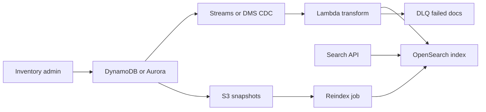

# Search with OpenSearch and CDC

## Use case

An ecommerce app needs text search, filters, facets, sorting, and suggestions. The source of truth is in DynamoDB or Aurora.

## Main decision

Use **OpenSearch** when you need full-text search, facets, ranking, flexible filters, or hybrid/vector search.

Do not use OpenSearch as the primary transactional database. Use **DynamoDB/Aurora** as the source of truth. Use **Athena** for historical analytics. Use **S3 Vectors** for low-QPS vector storage.

## Key questions

- Which entity is the source of truth?
- Do you need text search or only key lookup?
- How quickly must changes be reflected?
- Can you tolerate eventual consistency?
- Which fields are indexed, and which are sensitive?
- Do you need facets, autocomplete, or vector search?

## Why these services

- **OpenSearch**: search and aggregation engine.
- **DynamoDB Streams/Lambda**: simple CDC from DynamoDB.
- **DMS**: CDC from relational databases.
- **S3**: dead-letter or reindex snapshots.
- **CloudWatch**: cluster/indexing health.

## Pros

- Powerful search.
- Flexible facets and filters.
- Good complement to OLTP.
- Can support dashboards.
- Enables controlled reindexing.

## Cons

- Eventual consistency.
- Indexes require tuning.
- Cluster costs can be significant.
- Bad mappings are hard to change.
- Reindexing must be planned.

## Alerts and cost

Minimum:

- Cluster status red/yellow.
- CPU, JVM memory pressure, storage.
- Indexing latency and rejected writes.
- p99 search latency.
- Indexer DLQ.
- Budget for nodes/OCU, storage, and snapshots.

## Natural evolution

- If the index desynchronizes: reindex pipeline from source of truth.
- If QPS rises: replicas, shards, and query cache.
- If vectors appear: evaluate OpenSearch vector or S3 Vectors + OpenSearch.
- If filters are simple: a DynamoDB GSI may be enough.
- If analytics dominates: send data to S3 Tables.

## Applied Examples

### Example 1: Real estate property search

**Context:** A real estate portal needs text search, city/price filters, facets, and relevance sorting while transactional inventory changes all day.

**Questions and answers:**

- **Why not query DynamoDB or SQL directly?** Full-text search, facets, and scoring belong in OpenSearch; the transactional database remains the operational source of truth.
- **How do changes reach the index?** CDC from DynamoDB Streams or DMS for Aurora, with Lambda/Firehose/OpenSearch Ingestion transforming documents.
- **How is eventual consistency handled?** Show an `indexing` state, tolerate measured delay, and alarm on lag or DLQ failures.

**Architecture by stage:**

- **Initial project:** CRUD stores properties in DynamoDB/Aurora; a process indexes changes into OpenSearch; the search API queries the index.
- **Middle stage:** DLQ for failed documents, reindex from S3 snapshots, domain synonyms, and ingest latency dashboards.
- **Large-scale projection:** Separate clusters or collections by domain, use OpenSearch Serverless or dedicated domains depending on QPS, add hybrid vector search, and keep historical data in the lake.

**Migration/evolution:** If SQL `LIKE` is used today, duplicate changes to OpenSearch, compare results, redirect search first, and keep SQL as the source of truth.

**Related patterns:** [nosql-dynamodb-single-table](../nosql-dynamodb-single-table/index.md), [relational-sql-aurora-postgresql](../relational-sql-aurora-postgresql/index.md), [ai-rag-bedrock-vectors](../ai-rag-bedrock-vectors/index.md).

## Practice exercise

Design product search. Define source of truth, index mapping, CDC pipeline, DLQ, and full reindex process.

