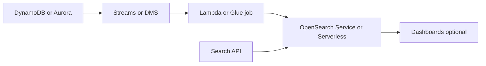
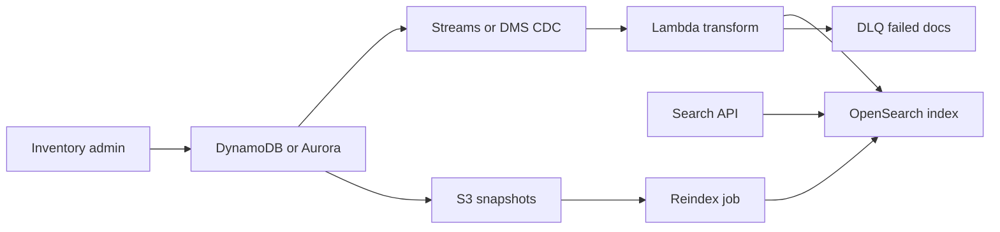

# Busqueda con OpenSearch y CDC

## Caso de uso

Un ecommerce necesita busqueda por texto, filtros, facetas, ordenamiento y sugerencias. La fuente de verdad esta en DynamoDB o Aurora.

## Decision principal

Usa **OpenSearch** cuando necesitas full-text search, facetas, ranking, filtros flexibles o busqueda hibrida/vectorial.

No uses OpenSearch como base transaccional primaria. Usa **DynamoDB/Aurora** como source of truth. Usa **Athena** para analitica historica. Usa **S3 Vectors** para almacenamiento vectorial de bajo QPS.

## Preguntas clave

- Que entidad es source of truth?
- Necesitas busqueda textual o solo lookup por clave?
- Que tan rapido debe reflejar cambios?
- Puedes tolerar consistencia eventual?
- Que campos se indexan y cuales son sensibles?
- Necesitas facetas, autocomplete o vector search?

## Por que estos servicios

- **OpenSearch**: motor de busqueda y agregaciones.
- **DynamoDB Streams/Lambda**: CDC simple desde DynamoDB.
- **DMS**: CDC desde bases relacionales.
- **S3**: dead-letter o reindex snapshots.
- **CloudWatch**: salud de cluster/indexacion.

## Pros

- Busqueda potente.
- Facetas y filtros flexibles.
- Buen complemento para OLTP.
- Puede soportar dashboards.
- Permite reindexacion controlada.

## Contras

- Consistencia eventual.
- Indices requieren tuning.
- Costos de cluster pueden ser relevantes.
- Mapeos mal definidos son dificiles de cambiar.
- Reindexacion debe planearse.

## Alertas y costos

Minimo:

- Cluster status red/yellow.
- CPU, JVM memory pressure, storage.
- Indexing latency y rejected writes.
- Search latency p99.
- DLQ del indexer.
- Budget por nodos/OCU, storage y snapshots.

## Evolucion natural

- Si el indice se desincroniza: pipeline de reindex desde source of truth.
- Si QPS sube: replicas, shards y cache de queries.
- Si aparecen vectores: evaluar OpenSearch vector o S3 Vectors + OpenSearch.
- Si solo hay filtros simples: quizas DynamoDB GSI basta.
- Si analytics domina: mandar datos a S3 Tables.

## Ejemplos aplicados

### Ejemplo 1: Busqueda de propiedades inmobiliarias

**Contexto:** Un portal inmobiliario necesita busqueda por texto, filtros por ciudad/precio, facetas y ordenamiento por relevancia, mientras el inventario transaccional cambia todo el dia.

**Preguntas y respuestas:**

- **Por que no consultar DynamoDB o SQL directamente?** Full-text search, facetas y scoring son responsabilidad de OpenSearch; la base transaccional mantiene verdad operacional.
- **Como llega el cambio al indice?** CDC desde DynamoDB Streams o DMS para Aurora, con Lambda/Firehose/OpenSearch Ingestion transformando documentos.
- **Como manejar consistencia eventual?** Mostrar estado `indexing`, tolerar retraso medido y alarmar por lag o fallas de DLQ.

**Diseno por etapa:**

- **Proyecto inicial:** CRUD guarda propiedades en DynamoDB/Aurora; un proceso indexa cambios a OpenSearch; API de busqueda consulta indice.
- **Etapa media:** DLQ para documentos fallidos, reindex desde S3 snapshots, sinonimos por dominio y dashboards de ingest latency.
- **Gran escala:** Separar clusters o colecciones por dominio, usar OpenSearch Serverless o dominios dedicados segun QPS, hybrid search con vectores y data lake historico.

**Migracion/evolucion:** Si hoy hay `LIKE` en SQL, duplicar cambios a OpenSearch, comparar resultados, redirigir busquedas primero y mantener SQL como fuente de verdad.

**Patrones relacionados:** [nosql-dynamodb-single-table](../nosql-dynamodb-single-table/index.md), [relational-sql-aurora-postgresql](../relational-sql-aurora-postgresql/index.md), [ai-rag-bedrock-vectors](../ai-rag-bedrock-vectors/index.md).

## Ejercicio de practica

Disena busqueda de productos. Define source of truth, mapeo de indice, pipeline CDC, DLQ y proceso de reindex completo.

