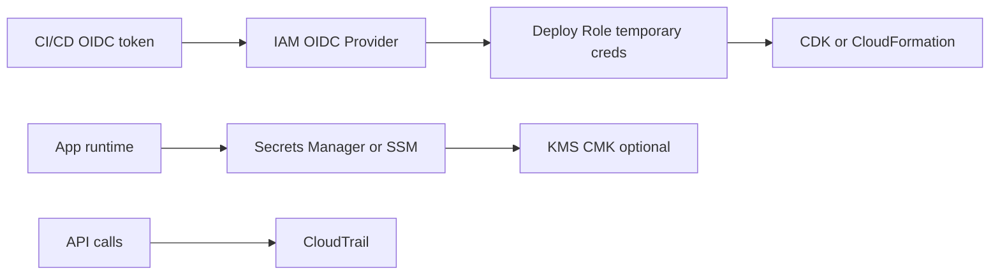

# Security with IAM, Secrets, and OIDC

## Use case

A team needs to deploy from CI/CD, connect services to databases, manage secrets, and audit actions without long-lived credentials.

## Main decision

Use **OIDC + temporary IAM roles** for CI/CD and **Secrets Manager/SSM + KMS** for secrets. Apply least privilege per workload.

Avoid permanent access keys in pipelines. Avoid secrets in plain environment variables, Docker images, repositories, or agent prompts.

## Key questions

- Who assumes the role and under which condition?
- Can permission be limited by repo, branch, or workflow?
- Which service needs to read which secret?
- Is automatic rotation configured?
- Which actions must be audited?
- Is there broad `iam:PassRole` risk?

## Why these services

- **OIDC**: temporary credentials for CI/CD.
- **IAM roles**: permissions by identity and workload.
- **Secrets Manager**: secrets with rotation and audit.
- **SSM Parameter Store**: configuration and simple secrets.
- **KMS**: encryption control.
- **CloudTrail**: audit.

## Pros

- Reduces leaked credential risk.
- Expressive and auditable permissions.
- Secret rotation.
- Native integration with Lambda/ECS/RDS.
- Better compliance posture.

## Cons

- IAM has complex edge cases.
- Overly broad policies create escalation.
- KMS key policies can block legitimate access.
- Rotation requires testing.
- AccessDenied debugging requires method.

## Alerts and controls

Minimum:

- CloudTrail enabled.
- GuardDuty and Security Hub where applicable.
- IAM Access Analyzer.
- Alarms for sensitive IAM changes.
- Secret leak detection in CI.

Guardrails:

- Scope `iam:PassRole` to specific roles.
- Trust policies with OIDC conditions.
- One role per Lambda or task when possible.
- Do not use `*FullAccess` in production.
- Do not read secrets directly into agent context.

## Natural evolution

- If there are many teams: IAM Identity Center and permission sets.
- If multi-account: SCPs and separate accounts.
- If secrets are per tenant: naming, tags, and policies by tenant.
- If compliance grows: customer managed KMS keys and rotation.
- If AccessDenied is frequent: policy simulator and Access Analyzer.

## Practice exercise

Design a deploy role that can only be assumed by GitHub Actions from branch `main`. Define minimum permissions to deploy a CDK stack.

