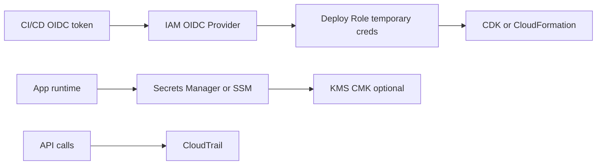
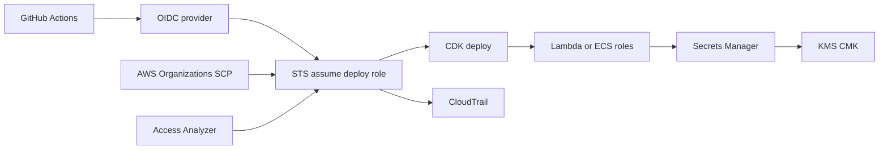

# Seguridad con IAM, Secrets y OIDC

## Caso de uso

Un equipo necesita desplegar desde CI/CD, conectar servicios a bases, manejar secretos y auditar acciones sin credenciales largas.

## Decision principal

Usa **OIDC + IAM roles temporales** para CI/CD y **Secrets Manager/SSM + KMS** para secretos. Aplica least privilege por workload.

Evita access keys permanentes en pipelines. Evita secretos en variables de entorno planas, imagenes Docker, repositorios o prompts de agentes.

## Preguntas clave

- Quien asume el rol y bajo que condicion?
- El permiso puede limitarse por repo, branch o workflow?
- Que servicio necesita leer que secreto?
- Hay rotacion automatica?
- Que acciones deben quedar auditadas?
- Existe riesgo de `iam:PassRole` amplio?

## Por que estos servicios

- **OIDC**: credenciales temporales para CI/CD.
- **IAM roles**: permisos por identidad y workload.
- **Secrets Manager**: secretos con rotacion y auditoria.
- **SSM Parameter Store**: configuracion y secretos simples.
- **KMS**: control de cifrado.
- **CloudTrail**: auditoria.

## Pros

- Reduce riesgo de credenciales filtradas.
- Permisos expresivos y auditables.
- Rotacion de secretos.
- Integracion nativa con Lambda/ECS/RDS.
- Mejor postura para compliance.

## Contras

- IAM tiene bordes complejos.
- Politicas demasiado amplias crean escalacion.
- KMS key policies pueden bloquear accesos legitimos.
- Rotacion requiere pruebas.
- Debugging de AccessDenied exige metodo.

## Alertas y controles

Minimo:

- CloudTrail habilitado.
- GuardDuty y Security Hub donde aplique.
- IAM Access Analyzer.
- Alarmas por cambios IAM sensibles.
- Deteccion de secret leaks en CI.

Guardrails:

- `iam:PassRole` acotado a roles especificos.
- Trust policies con condiciones OIDC.
- Un rol por Lambda o task cuando sea posible.
- No usar `*FullAccess` en produccion.
- No leer secretos directamente al contexto del agente.

## Evolucion natural

- Si hay muchos equipos: IAM Identity Center y permission sets.
- Si hay multi-account: SCPs y cuentas separadas.
- Si hay secretos por tenant: naming, tags y policies por tenant.
- Si hay compliance: customer managed KMS keys y rotation.
- Si AccessDenied es frecuente: policy simulator y Access Analyzer.

## Ejemplos aplicados

### Ejemplo 1: Plataforma SaaS con despliegue GitHub Actions sin access keys

**Contexto:** Un equipo despliega CDK desde GitHub Actions, usa secretos de proveedores externos y necesita aislar dev, staging y prod.

**Preguntas y respuestas:**

- **Como evita credenciales largas?** OIDC permite que CI/CD asuma roles temporales via STS; no se guardan access keys en GitHub.
- **Como se limita `iam:PassRole`?** Resource ARN especifico, condicion `iam:PassedToService` y roles por pipeline/ambiente.
- **Donde van secretos y llaves?** Secrets Manager con KMS customer managed key, rotacion cuando aplica y acceso por task role o Lambda role.

**Diseno por etapa:**

- **Proyecto inicial:** Cuentas separadas dev/staging/prod, OIDC provider, role de deploy por ambiente, Secrets Manager y CloudTrail multi-region.
- **Etapa media:** Permission boundaries, Access Analyzer, SCPs basicos, rotacion de secretos, KMS por dominio y deteccion GuardDuty/Security Hub.
- **Gran escala:** Modelo multi-account por workload, break-glass auditado, ABAC por tags, centralizacion de logs y revisiones automaticas de least privilege.

**Migracion/evolucion:** Si hay access keys en CI, crear OIDC en paralelo, migrar un pipeline no critico, revocar keys y despues endurecer politicas de trust.

**Patrones relacionados:** [multi-account-networking-vpc-endpoints](../multi-account-networking-vpc-endpoints/index.md), [observability-cloudwatch-xray-adot](../observability-cloudwatch-xray-adot/index.md), [cost-guardrails-budgets-anomaly](../cost-guardrails-budgets-anomaly/index.md).

## Ejercicio de practica

Disena un rol de deploy que solo pueda ser asumido por GitHub Actions desde branch `main`. Define permisos minimos para desplegar una stack CDK.

