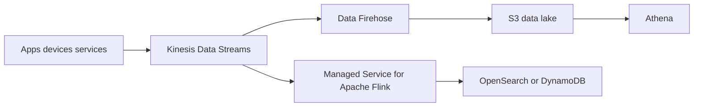

# Realtime Analytics Streaming with Kinesis

## Use case

Capture continuous events from clickstream, IoT, application logs, or telemetry for realtime aggregations and historical storage.

## Main decision

Use **Kinesis Data Streams** when you need continuous ingestion, ordering by shard/partition key, retention, and independent consumers inside the AWS ecosystem.

Use **SQS** for async tasks without replay. Use **MSK** if your organization already operates Kafka or needs Kafka APIs. Use **direct Firehose** if you only want to deliver data to S3/OpenSearch/Redshift without custom consumers.

## Key questions

- Do you need replay from an earlier position?
- Are there several consumers reading the same data?
- Does ordering by entity matter?
- Is volume sustained or just spiky?
- Do you need windows, joins, or aggregations?
- How long should events be retained?

## Why these services

- **Kinesis Data Streams**: managed log with retention and consumers.
- **Flink**: stateful processing, windows, joins, enrichment.
- **Firehose**: managed delivery to S3/OpenSearch/Redshift.
- **S3 + Athena**: queryable history.

## Pros

- Good fit for AWS-native streaming.
- Replay within retention.
- Direct integration with Lambda, Flink, and Firehose.
- Less operation than Kafka.
- Ordering by partition key.

## Cons

- Partition key design is critical.
- Shards/capacity must be understood if not using on-demand mode.
- It is not a simple task queue.
- Stateful processing adds complexity.
- Costs grow with volume and retention.

## Alerts and cost

Minimum:

- IteratorAgeMilliseconds or consumer lag.
- PutRecord throttling.
- IncomingBytes/Records.
- Flink checkpoint failures and backpressure.
- Firehose delivery failures.
- Budget for ingestion, enhanced fan-out, retention, and processing.

## Natural evolution

- If you only store to S3: simplify with Firehose.
- If you need Kafka API: migrate or integrate with MSK.
- If an aggregation becomes critical: Flink with checkpoints and alarms.
- If hot partitions appear: redesign partition key.
- If historical analytics dominates: model S3 Tables/Iceberg.

## Practice exercise

Design ingestion for `page_view` events. Define partition key, retention, realtime consumer, S3 delivery, and lag alarm.

